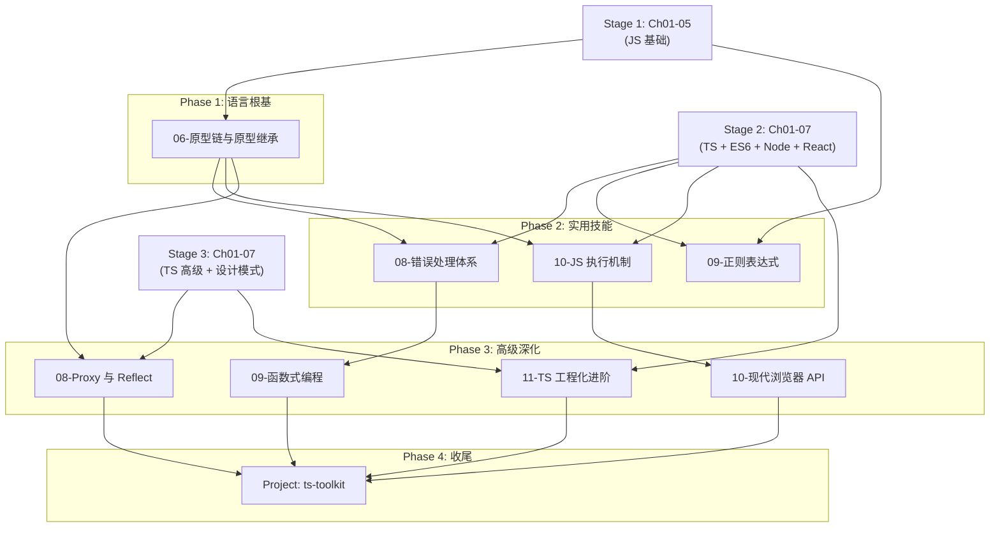

# JS/TS 核心深化学习材料构建计划

> **状态追踪文档** — 用于跨窗口跟踪编写进度
> **创建日期**: 2026-02-08
> **最后更新**: 2026-02-09

---

## 进度总览

| # | 任务 | 位置 | 状态 | 预计行数 | 工作量 |
|---|------|------|------|----------|--------|
| 1 | Stage 1: 06-原型链与原型继承 | `stage-1-beginner/` | ✅ 已完成 | README ~800 + 代码 ~600 | 1 单元 |
| 2 | Stage 2: 08-错误处理体系 | `stage-2-intermediate/` | ✅ 已完成 | README ~700 + 代码 ~500 | 1 单元 |
| 3 | Stage 2: 09-正则表达式 | `stage-2-intermediate/` | ✅ 已完成 | README ~700 + 代码 ~500 | 1 单元 |
| 4 | Stage 2: 10-JS 执行机制深入 | `stage-2-intermediate/` | ✅ 已完成 | README ~800 + 代码 ~400 | 1 单元 |
| 5 | Stage 3: 08-Proxy 与 Reflect | `stage-3-advanced/` | ✅ 已完成 | README ~700 + 代码 ~600 | 1 单元 |
| 6 | Stage 3: 09-函数式编程范式 | `stage-3-advanced/` | ✅ 已完成 | README ~800 + 代码 ~700 | 1 单元 |
| 7 | Stage 3: 10-现代浏览器 API | `stage-3-advanced/` | ✅ 已完成 | README ~700 + 代码 ~600 | 1 单元 |
| 8 | Stage 3: 11-TS 工程化进阶 | `stage-3-advanced/` | ✅ 已完成 | README ~800 + 代码 ~600 | 1 单元 |
| 9 | 实战项目: ts-toolkit 工具库 | `stage-3-advanced/projects/` | ✅ 已完成 | README ~800 + 代码 ~1500 | 2 单元 |
| 10 | 练习题集 (25 题) | 分散至各 Stage | ✅ 已完成 | ~1200 行 | 0.5 单元 |
| 11 | 更新 Stage README / PROGRESS | 各 Stage README | ✅ 已完成 | ~300 行 | 0.5 单元 |
| | **总计** | | **11/11 (100%)** | **README ~6800 + 代码 ~5500** | **~11 单元** |

**状态图例**: ⬜ 待开始 | 🔨 进行中 | ✅ 已完成 | ⏸️ 暂停

---

## 执行顺序（按依赖关系）

```
Phase 1 (语言根基)            → Phase 2 (实用技能)         → Phase 3 (高级深化)
06-原型链与原型继承 (S1)        08-错误处理体系 (S2)          08-Proxy 与 Reflect (S3)
                              09-正则表达式 (S2)            09-函数式编程范式 (S3)
                              10-JS 执行机制 (S2)           10-现代浏览器 API (S3)
                                                           11-TS 工程化进阶 (S3)

Phase 4 (收尾)
Project: ts-toolkit
Exercises
README / PROGRESS 更新
```

**关键依赖**:
- Phase 1 是 Phase 2 的前置（原型链是执行机制、错误体系的基础）
- Phase 2 中三个章节可并行编写
- Phase 3 中 Proxy/Reflect 依赖原型链理解；函数式编程独立；浏览器 API 独立；TS 工程化独立
- Phase 4 的 Project 综合了 Phase 1-3 所有知识

---

## 一、问题背景

当前教程体系在 JavaScript/TypeScript 的**广度**上覆盖良好（从基础语法到高级类型、从 Node.js 到设计模式），但在**深度**上存在若干结构性盲区：

1. **语言机制层缺失** — 原型链作为 JS 最核心的机制，仅在旁注中零星提及，从未系统讲解；执行上下文和词法环境也缺少独立章节
2. **实用技能层缺失** — 正则表达式和错误处理作为每个项目必用的基础技能，没有专题覆盖
3. **元编程层缺失** — Proxy/Reflect 是 Vue 3 等框架的核心机制，装饰器章节只用了 `Reflect.getMetadata`，远未完整
4. **编程范式层缺失** — 函数式编程已渗透到现代 JS/TS 的每个角落（React Hooks、数组方法链、不可变数据），但从未被系统教授
5. **工程实践层缺失** — TypeScript 声明文件、项目工程化、模块化生态等实际项目必备知识未覆盖
6. **平台 API 层缺失** — 除 DOM 和 localStorage 外，现代浏览器 API（Web Workers、Observer 系列、File API 等）完全空白

这些缺失意味着：学完现有教程的学生能写出 TypeScript 代码，但可能无法解释 `class` 背后发生了什么、无法为无类型的第三方库编写 `.d.ts`、无法用 Proxy 实现一个简单的数据验证层、无法写出惯用的函数式风格代码。

---

## 二、整体结构设计

### 2.1 设计原则：分散嵌入，而非独立阶段

与 `stage-modern-frontend/`（全新独立阶段）不同，本次补充采用**嵌入式策略**——将新章节插入到已有阶段的恰当位置。原因：

- 这些内容是对**已有知识轴**的深化，而非全新的技术栈
- 按难度梯度自然归属到 Stage 1/2/3
- 避免学生在学完 Stage 3 后还要"回头补课"的反直觉体验

### 2.2 新增章节分布

```
learning-plan/
  stage-1-beginner/
    ...existing 01-05...
    06-prototype-inheritance/          (新增) ← Phase 1
      README.md
      examples/
        01-prototype-basics.js
        02-prototype-chain.js
        03-inheritance-patterns.js
        04-class-vs-prototype.js

  stage-2-intermediate/
    ...existing 01-07...
    08-error-handling/                 (新增) ← Phase 2
      README.md
      examples/
        01-error-types.ts
        02-custom-errors.ts
        03-async-error-handling.ts
        04-global-error-handlers.ts
        05-error-strategies.ts
    09-regexp/                         (新增) ← Phase 2
      README.md
      examples/
        01-regexp-basics.ts
        02-groups-and-lookaround.ts
        03-common-patterns.ts
        04-performance-and-redos.ts
    10-js-execution-model/             (新增) ← Phase 2
      README.md
      examples/
        01-execution-context.js
        02-lexical-environment.js
        03-hoisting-unified.js
        04-tdz-and-closures.js

  stage-3-advanced/
    ...existing 01-07...
    08-proxy-reflect/                  (新增) ← Phase 3
      README.md
      examples/
        01-proxy-traps.ts
        02-reactive-store.ts
        03-validation-proxy.ts
        04-reflect-api.ts
    09-functional-programming/         (新增) ← Phase 3
      README.md
      examples/
        01-pure-functions.ts
        02-composition.ts
        03-currying-partial.ts
        04-immutable-patterns.ts
        05-functional-error-handling.ts
    10-browser-apis/                   (新增) ← Phase 3
      README.md
      examples/
        01-web-workers.ts
        02-observer-apis.ts
        03-file-and-stream-api.ts
        04-advanced-fetch.ts
        05-module-ecosystem.ts
    11-ts-engineering/                 (新增) ← Phase 3
      README.md
      examples/
        01-declaration-files.ts
        02-module-augmentation.ts
        03-advanced-type-patterns.ts
        04-project-references/
        05-build-tools-comparison.ts
    projects/
      ...existing realtime-chat/...
      ts-toolkit/                      (新增) ← Phase 4
        README.md
        package.json
        tsconfig.json
        src/
        tests/
```

### 2.3 依赖关系图



---

## 三、代码组织约束（重要）

本次所有新内容必须遵循以下代码分离原则：

### 3.1 README.md — 只留讲解性片段

README 中的代码**仅用于说明概念**，遵循以下约束：

- 每个代码块 **≤ 15 行**，用于展示核心思想
- 不包含完整可运行的程序
- 用 `// ... 完整实现见 examples/xxx.ts` 标注指向完整代码的路径
- 侧重 ✅/❌ 对比片段（各 3-8 行）

```markdown
<!-- README 中的代码示例格式 -->

❌ 错误做法：直接修改原型
```javascript
Array.prototype.first = function() { return this[0]; };
// 污染了所有数组实例的原型
```

✅ 正确做法：使用工具函数
```javascript
function first<T>(arr: T[]): T | undefined { return arr[0]; }
// 纯函数，无副作用，类型安全
```

> 完整的原型链演示见 [`examples/02-prototype-chain.js`](./examples/02-prototype-chain.js)
```

### 3.2 examples/ — 完整可运行代码

- 每个文件是一个独立的、可直接运行的示例
- 包含充分的 `console.log` 日志，让学生能追踪执行过程
- 文件头部包含 `@description` 注释说明本文件演示的知识点
- 文件名以数字编号，对应 README 中的讲解顺序

### 3.3 project/ — 完整项目代码

- 包含 `package.json`、`tsconfig.json`、完整源码和测试
- README 只描述项目目标、架构说明和实施步骤
- 所有实现代码在 `src/` 目录

---

## 四、Stage 1 新增章节详细设计

### 4.1 Chapter 06: 原型链与原型继承 (06-prototype-inheritance)

**预计篇幅**: README ~800 行 + 代码 ~600 行 | **学习时间**: 3-4 天
**文件路径**: `stage-1-beginner/06-prototype-inheritance/`

**为什么放在 Stage 1**:
原型链是 JavaScript 对象系统的底层机制。Stage 1 Ch03（对象和数组）教了"怎么用"对象，本章教"对象是怎么回事"。Stage 2 Ch02（ES6 Class）是原型的语法糖——不理解原型，就无法理解 Class 的行为边界。

**内容大纲**:

1. **对象的秘密：`[[Prototype]]`** — 每个 JS 对象都有一个隐藏链接
2. **原型链查找机制** — 属性查找如何沿链上溯，直到 `null`
3. **`Object.create()` 与原型式继承** — 不用 `new` 的继承方式
4. **构造函数与 `new` 的四步骤** — `new` 关键字到底做了什么
5. **`prototype` vs `__proto__` vs `Object.getPrototypeOf()`** — 三个容易混淆的概念
6. **原型链 vs ES6 Class** — 语法糖背后的真相
7. **`instanceof` 的原型链遍历** — 它如何沿链查找
8. **实战：不用 Class 实现继承** — 用原型手写 Stage 1 Todo App 的数据模型

**写作风格要求**:

**开篇名言**:
> *"In JavaScript, there are no classes. There are only objects linked to other objects."*
> — Kyle Simpson, *You Don't Know JS*
>
> 如果你以为 JavaScript 的 `class` 和 Java 的 `class` 是一回事，那你被骗了。JS 没有类——从来没有。它只有对象，以及对象之间的**链接**。`class` 关键字是 2015 年才贴上去的一层壁纸。撕开壁纸，你会看到一根叫做"原型链"的铁链，它从 1995 年 Brendan Eich 创造 JavaScript 的那一天起就在那里了。

**核心隐喻体系**:
- 🎭 **The Drama: 家族遗传与 DNA 链** — 每个 JS 对象都有一个"父亲"（原型）。当你问一个对象"你会 `toString()` 吗？"，如果它自己不会，它会去问它爹。它爹也不会？再问它爷爷。一直问到家族的始祖 `Object.prototype`。如果连始祖也不会，那就是 `undefined`。这条家族血脉就是**原型链**。`class Dog extends Animal` 不是在创建蓝图，它只是在两个家族之间建立了一条 DNA 链。
- 🧠 **CS Master's Bridge: 原型 vs 类的哲学根源** — Java/C++ 的 Class 来自柏拉图哲学（理念世界 → 现实世界的投射）。JS 的 Prototype 来自亚里士多德哲学（没有抽象的"理念"，只有具体的事物，事物之间通过相似性关联）。Brendan Eich 受 Self 语言影响，刻意选择了原型继承。这不是"JS 太简陋所以没有类"，而是一种**不同的世界观**。
- ⚛️ **`new` 的四步拆解 — 魔术揭秘**: `new Dog('Buddy')` 看起来像 Java，但底层做了四件事：(1) 创建空对象 `{}`，(2) 把它的 `__proto__` 指向 `Dog.prototype`，(3) 用这个空对象作为 `this` 调用 `Dog` 函数，(4) 如果函数没返回对象就返回这个新对象。理解这四步，你就理解了为什么"忘写 `new`"会导致 `this` 指向全局对象。

**历史叙事线索**:
- Brendan Eich 的十日创世纪（1995 年 5 月）：网景公司要求他"做一个像 Java 的脚本语言"。Eich 本人更喜欢 Scheme（函数式）和 Self（原型），于是他把原型继承藏在了 Java 的 `new` 语法外壳之下。这个妥协导致了 20 年的困惑——人们看到 `new`，以为有 Class；看到 `prototype`，以为是残废的 Class。直到 Kyle Simpson 写了 *YDKJS*，社区才开始正视："JS 就是原型语言，接受它。"

**哲学连接**:
- 🧘 **Zen of Code: 接受语言的本性** — "不要试图把 JavaScript 变成 Java。不要假装 `class` 就是经典 OOP。真正掌握一门语言，意味着理解它的设计哲学，而不是把你熟悉的范式强加于它。原型继承不是'残废的类继承'——它是一种不同的、有时更灵活的继承模型。"
- 连接到 Stage 5 范式战争章节：原型继承是 JS 身份认同的核心战场。

**章节间连接**:
| 向前连接 | 向后连接 |
|---------|---------|
| Stage 1 Ch03 对象和数组（对象的"DNA继承"旁注，现在完整展开） | Stage 2 Ch02 ES6 Class（Class 是原型的语法糖，有了原型基础才能理解 Class 的边界） |
| Stage 1 Ch02 函数/this（`new` 对 this 的绑定，现在揭示底层原理） | Stage 3 Ch02 装饰器（装饰器修改的是 `prototype` 上的属性描述符） |

---

## 五、Stage 2 新增章节详细设计

### 5.1 Chapter 08: 错误处理体系 (08-error-handling)

**预计篇幅**: README ~700 行 + 代码 ~500 行 | **学习时间**: 2-3 天
**文件路径**: `stage-2-intermediate/08-error-handling/`

**为什么放在 Stage 2**:
错误处理需要 TypeScript 的类型系统（自定义错误类、类型收窄）和异步知识（Promise rejection、async/await try/catch）。这两者在 Stage 2 Ch01 和 Ch04 中已覆盖。

**内容大纲**:

1. **错误的哲学** — 错误不是"出了问题"，错误是系统与现实世界交互的必然产物
2. **Error 类型体系** — Error、TypeError、RangeError、ReferenceError、SyntaxError 及其语义
3. **自定义错误类** — 继承 Error、保持 `name` 和 `stack`、错误码设计
4. **同步与异步错误处理** — try/catch、Promise.catch、async/await 中的统一模型
5. **全局错误兜底** — `window.onerror`、`unhandledrejection`、Node.js `process.on('uncaughtException')`
6. **错误处理策略** — "抛出 vs 返回"、Result 模式（`{ ok, error }`）、何时 crash 何时恢复
7. **结构化错误日志** — 错误信息的可观测性设计

**写作风格要求**:

**开篇名言**:
> *"The only truly secure system is one that is powered off, cast in a block of concrete and sealed in a lead-lined room with armed guards."* — Gene Spafford
>
> 你的代码会崩溃。不是"可能"，是"一定"。网络会断、磁盘会满、用户会输入 emoji 到手机号字段、第三方 API 会返回 `null`。区别不在于你的代码是否会遇到错误，而在于**它遇到错误时的行为是否可预测**。一个没有错误处理的程序就像一辆没有安全气囊的汽车——晴天开起来毫无区别，但下雨天你会后悔。

**核心隐喻体系**:
- 🎭 **The Drama: 错误的三重人格** — 错误有三张面孔：(1) **程序员的 Bug**（TypeError: cannot read property of undefined）——你写错了，修代码。(2) **业务的例外**（用户余额不足、用户名已存在）——可预期，优雅处理。(3) **环境的灾难**（数据库挂了、内存耗尽）——不可控，快速失败 + 告警。**三张面孔需要三种完全不同的处理策略**，但很多人把它们混为一谈。
- 🌌 **The Big Picture: Fail Fast vs Fail Safe** — 核电站的设计原则是 Fail Safe（出错时自动关闭反应堆，进入安全状态）。航空电子的设计原则是 Fail Operational（出错时切换到备用系统，继续飞行）。你的 API 接口应该 Fail Fast（参数非法就立刻 400，不要带着脏数据走完整条链路）。你的 UI 应该 Fail Safe（后端挂了就显示缓存数据或友好提示，不要白屏）。
- ⚛️ **Result 模式 — Go 语言的"错误即值"哲学在 TS 中的化身**: Go 不用 try/catch，它返回 `(value, error)` 元组。Rust 用 `Result<T, E>` 枚举。在 TypeScript 中，你可以用 `{ ok: true, data: T } | { ok: false, error: E }` 实现类似模式。这种方式的好处是：**错误不会被意外忽略**——你必须检查 `ok` 字段才能拿到 `data`，编译器强制你处理错误路径。

**历史叙事线索**:
- JavaScript 的 try/catch 来自 Java（1996 年 ES3 引入），但 JS 的异常和 Java 有本质区别——JS 可以 `throw` 任何值（字符串、数字、对象），而 Java 只能 throw Throwable 的子类。这种"自由"看似灵活，实际上让 `catch (e)` 变成了一个"盲盒"——你永远不知道 `e` 是什么类型。TypeScript 5.0+ 的 `catch (e: unknown)` 是对这个历史债的清算。
- Node.js 早期的 "callback hell with err-first" 模式（`function(err, data)`）→ Promise → async/await 的演进。每一步都在改善错误处理的人体工学。

**章节间连接**:
| 向前连接 | 向后连接 |
|---------|---------|
| Stage 1 Ch04 异步基础（Promise 错误处理的入门） | Stage 3 Ch04 架构最佳实践（错误边界、防御性编程） |
| Stage 2 Ch01 TS 基础（类型收窄、自定义类） | Stage Modern Frontend Ch05 tRPC（类型安全的错误传播） |
| Stage 2 Ch05 可观测性（日志、追踪） | Stage 4 Ch04 可靠性工程（熔断、降级） |

---

### 5.2 Chapter 09: 正则表达式 (09-regexp)

**预计篇幅**: README ~700 行 + 代码 ~500 行 | **学习时间**: 2-3 天
**文件路径**: `stage-2-intermediate/09-regexp/`

**内容大纲**:

1. **正则表达式的本质** — 它是一种声明式的字符串模式匹配语言
2. **基础语法** — 字符类、量词、锚点、转义
3. **捕获组与反向引用** — `()` 分组、命名捕获 `(?<name>)`、非捕获组 `(?:)`
4. **断言（Lookaround）** — 前瞻 `(?=)`、后顾 `(?<=)`、否定断言
5. **JavaScript 中的 RegExp API** — `test`、`match`、`matchAll`、`replace`、`split`
6. **常见实战模式** — 邮箱、URL、手机号、密码强度、代码高亮
7. **性能与安全** — 回溯灾难（Catastrophic Backtracking）与 ReDoS 攻击

**写作风格要求**:

**开篇名言**:
> *"Some people, when confronted with a problem, think 'I know, I'll use regular expressions.' Now they have two problems."* — Jamie Zawinski
>
> 这句 1997 年的名言至今仍在流传。正则表达式是编程界最两极分化的工具——有人视之为神器，有人避之如蛇蝎。真相介于两者之间：正则是一把手术刀，用对了它精准无比，用错了它伤人于无形。本章的目标不是让你成为正则大师，而是让你**知道什么时候该用、什么时候不该用**。

**核心隐喻体系**:
- 🎭 **The Drama: 正则的读写不对称性** — 写一个正则表达式需要 5 分钟。三个月后读懂同一个正则表达式需要 50 分钟。正则是**只写语言**（write-only language）——它牺牲了可读性，换来了简洁性。这就是为什么所有超过 30 个字符的正则表达式都应该加注释，或者拆分成多步处理。
- 🧠 **CS Master's Bridge: 正则表达式 = 有限状态自动机 (FSA)** — 每个正则表达式在编译后都会变成一个有限状态自动机（NFA 或 DFA）。`/ab*c/` 变成：`q0 --a--> q1 --b--> q1 --c--> q2(accept)`。理解 NFA 的回溯行为，就能理解为什么 `/^(a+)+$/` 对 `"aaaaaaaaaaaaaaaaab"` 会导致指数级回溯（2^n 条路径），造成 ReDoS 攻击。
- ⚛️ **命名捕获组 — 给魔法贴标签**: `/(\d{4})-(\d{2})-(\d{2})/` 匹配日期，但 `match[1]` 是年还是月？谁也记不住。`/(?<year>\d{4})-(?<month>\d{2})-(?<day>\d{2})/` 让你用 `match.groups.year` 访问。**给正则的捕获组命名，就像给函数的参数命名——它把"位置依赖"变成了"语义依赖"**。

**历史叙事线索**:
- 正则表达式的学术起源：Stephen Kleene (1956) 的正则语言理论 → Ken Thompson 在 Unix ed 编辑器中的实现 (1968) → Larry Wall 在 Perl 中的爆发 (1987) → PCRE 成为事实标准 → JavaScript 的 RegExp 对象。正则是少数几个从纯数学理论直接走进实际编程的工具。
- ES2018 的正则增强：命名捕获组、后顾断言、dotAll 模式、`matchAll`。JavaScript 用了 20 年才追上 Perl 的正则表达式能力。

**章节间连接**:
| 向前连接 | 向后连接 |
|---------|---------|
| Stage 1 Ch01 基础语法（字符串方法 `includes`/`indexOf` 的局限性） | Stage Modern Frontend Ch06 表单验证（Zod schema 中的 `.regex()` 验证） |
| Stage 2 Ch01 TS 基础（模板字面量类型中的模式匹配概念） | Stage 3 Ch07 重构（用正则进行批量代码重构） |

---

### 5.3 Chapter 10: JavaScript 执行机制深入 (10-js-execution-model)

**预计篇幅**: README ~800 行 + 代码 ~400 行 | **学习时间**: 3-4 天
**文件路径**: `stage-2-intermediate/10-js-execution-model/`

**内容大纲**:

1. **执行上下文 (Execution Context)** — 全局/函数/eval 三种上下文的创建与销毁
2. **词法环境 (Lexical Environment)** — Environment Record + 外部引用，作用域链的真正实现
3. **变量提升的统一模型** — `var`、`let`/`const`、`function`、`class` 的提升行为差异与本质
4. **暂时性死区 (TDZ)** — 为什么 `let` 在声明前不可访问
5. **闭包的底层实现** — 闭包如何通过词法环境的引用链实现
6. **尾调用优化 (TCO)** — ES6 规范中的尾调用优化及其现实中的支持状况
7. **`this` 绑定的完整规则** — 四种绑定规则的优先级：new > 显式 > 隐式 > 默认

**写作风格要求**:

**开篇名言**:
> *"You don't really understand something unless you can explain it to your grandmother."* — Albert Einstein
>
> 你已经知道"闭包能访问外部变量"、"let 不会提升"、"箭头函数没有自己的 this"。但你能解释**为什么**吗？这些行为不是语法层面的规定——它们是执行引擎内部数据结构的自然推论。当你理解了执行上下文和词法环境这两个核心数据结构，所有那些看似"需要记忆的规则"都会变成"显而易见的推论"。

**核心隐喻体系**:
- 🎭 **The Drama: 执行上下文 — 舞台剧的场景切换** — 想象 JavaScript 引擎是一座剧院。全局代码是第一幕（全局执行上下文）。每次调用函数，就换一幕（新的函数执行上下文压入调用栈）。每一幕都有自己的布景（变量环境）、道具（局部变量）、和一张"上一幕的剧照"（外部词法环境引用）。当这一幕演完（函数 return），布景被拆掉（执行上下文出栈），但如果有人拍了照片保留了（闭包），那些道具就不会被清理。
- 🧠 **CS Master's Bridge: 词法环境 ≈ 作用域链的链表实现** — 每个词法环境包含两部分：(1) Environment Record（当前作用域的变量表，类似哈希表），(2) `[[OuterEnv]]`（指向外层词法环境的指针）。当引擎查找变量时，就是在做链表遍历：先查当前节点，没找到就跟 `[[OuterEnv]]` 指针走到下一个节点。`null` 是链表的终点（全局作用域之外）。闭包的实现就是：函数对象持有它创建时所在的词法环境节点的引用，GC 不会回收这个节点。
- 🌌 **TDZ — 薛定谔的变量**: `let x = 1` 中的 `x`，在声明语句执行之前就已经存在于词法环境中了（被"提升"了），但它处于"未初始化"状态——你知道它在那里，但碰不到它。这个"存在但不可触碰"的区间就是暂时性死区。这不是语法限制，而是 V8 引擎对变量生命周期的严格管理。

**历史叙事线索**:
- ECMAScript 规范中"执行上下文"的演化：ES3 用 Activation Object（AO）/ Variable Object（VO） 解释，ES5 引入 Lexical Environment / Variable Environment，ES6 统一为 Environment Record。很多网上的教程还在用 ES3 的术语（AO/VO），这些术语在现代规范中已经过时。本章使用 ES6+ 的规范术语。

**章节间连接**:
| 向前连接 | 向后连接 |
|---------|---------|
| Stage 1 Ch02 函数和作用域（闭包和 this 的入门讲解） | Stage 3 Ch05 性能优化（内存管理、GC 的执行上下文视角） |
| Stage 1 Ch04 异步基础（事件循环的宏观理解） | Stage 3 Ch08 Proxy/Reflect（元编程需要理解对象模型的底层） |
| Stage 1 Ch06 原型链（对象模型的另一半拼图） | Stage 5 Ch03 范式战争（词法作用域 vs 动态作用域的历史选择） |

---

## 六、Stage 3 新增章节详细设计

### 6.1 Chapter 08: Proxy 与 Reflect (08-proxy-reflect)

**预计篇幅**: README ~700 行 + 代码 ~600 行 | **学习时间**: 3-4 天
**文件路径**: `stage-3-advanced/08-proxy-reflect/`

**为什么放在 Stage 3**:
Proxy 是 ES6 元编程三剑客（Proxy + Reflect + Symbol）中最强大的。理解它需要扎实的对象模型知识（原型链）和 TypeScript 泛型能力。

**内容大纲**:

1. **元编程的三个层次** — 内省 (Introspection)、自修改 (Self-Modification)、拦截 (Intercession)
2. **Proxy 的 13 种 Trap** — get、set、has、deleteProperty、apply、construct 等
3. **Reflect API** — 与 Proxy trap 一一对应的默认行为函数
4. **实战：响应式数据存储** — 用 Proxy 实现一个简化版 Vue 3 reactive()
5. **实战：验证代理** — 用 Proxy 实现运行时类型检查和数据验证
6. **实战：惰性初始化与虚拟化** — 用 Proxy 实现按需加载
7. **Proxy 的限制与性能** — 不可代理的对象、性能开销、可撤销代理 (Revocable Proxy)
8. **Proxy vs 装饰器** — 运行时拦截 vs 声明时修饰的选择

**写作风格要求**:

**开篇名言**:
> *"Any sufficiently advanced technology is indistinguishable from magic."* — Arthur C. Clarke
>
> 如果说 JavaScript 的 `class` 让你扮演建筑师，`decorator` 让你扮演魔法师，那么 `Proxy` 让你扮演**造物主**。你可以重新定义"读取属性"的含义、"赋值"的行为、"调用函数"的过程。这是语言提供给你的最底层的钩子——你在改写对象的**存在规则**。

**核心隐喻体系**:
- 🎭 **The Drama: Proxy — 对象的替身演员** — 在电影中，危险镜头由替身完成。观众看到的是主角在跳楼，实际上跳楼的是替身。Proxy 就是对象的替身——外界以为自己在和原始对象交互，实际上所有操作都被 Proxy 拦截、修改、然后（也许）转发给原始对象。Vue 3 的整个响应式系统就是：你以为你在读写 `state.count`，实际上你在和一个 Proxy 对话，它会悄悄通知 UI 更新。
- 🧠 **CS Master's Bridge: Proxy 的 MOP (Meta-Object Protocol)** — Proxy 的设计灵感来自 CLOS (Common Lisp Object System) 的 Meta-Object Protocol。MOP 的核心思想是：对象的基本操作（读属性、写属性、调用方法）不应该被硬编码在语言运行时中，而应该是可定制的。JavaScript 的 Proxy 实现了 MOP 的子集——13 个可拦截的"基本操作"（称为 Internal Methods），对应 `[[Get]]`、`[[Set]]`、`[[HasProperty]]` 等规范内部方法。
- ⚛️ **Reflect — Proxy 的默认行为手册**: 每个 Proxy trap 都有一个对应的 `Reflect` 方法。`Reflect.get(target, prop)` 就是"不加任何拦截的原始 get 操作"。在 Proxy 的 handler 中调用 `Reflect`，就像替身演员在完成特技后，把剩下的台词交回给主角来说。

**历史叙事线索**:
- Vue 2 的 `Object.defineProperty` → Vue 3 的 `Proxy` 迁移故事：`defineProperty` 只能拦截已有属性的 get/set，无法检测新增属性和数组索引变化（这就是为什么 Vue 2 需要 `Vue.set()`）。Proxy 从根本上解决了这些限制。这次迁移是 Vue 3 最大的 breaking change 之一，也是放弃 IE11 支持的直接原因。

**章节间连接**:
| 向前连接 | 向后连接 |
|---------|---------|
| Stage 1 Ch06 原型链（理解对象的内部操作） | Stage Modern Frontend Ch01 Next.js（理解框架的"魔法"背后的机制） |
| Stage 3 Ch02 装饰器（装饰器 vs Proxy 的选择） | Stage 4 Ch05 前端高级（Vue 3 响应式原理） |

---

### 6.2 Chapter 09: 函数式编程范式 (09-functional-programming)

**预计篇幅**: README ~800 行 + 代码 ~700 行 | **学习时间**: 3-4 天
**文件路径**: `stage-3-advanced/09-functional-programming/`

**内容大纲**:

1. **函数式编程的世界观** — 从"怎么做"到"是什么"的思维转换
2. **纯函数与副作用** — 纯函数的严格定义、引用透明性、副作用的隔离策略
3. **函数组合 (Composition)** — `compose`、`pipe`、管道操作符提案
4. **柯里化与偏应用 (Currying & Partial Application)** — 将多参函数转化为参数复用
5. **不可变数据操作** — Spread、`structuredClone`、Immer 的 Proxy 魔法
6. **函数式错误处理** — Option/Maybe 模式、Result/Either 模式
7. **Functional Core, Imperative Shell** — 架构模式的实战应用
8. **FP 在现代 JS/TS 中的渗透** — React Hooks、Array 方法链、Redux reducers

**写作风格要求**:

**开篇名言**:
> *"Object-oriented programming makes code understandable by encapsulating moving parts. Functional programming makes code understandable by minimizing moving parts."* — Michael Feathers
>
> 你已经会用 `.map()`、`.filter()`、`.reduce()` 了。你已经在写 React 的纯组件了。你已经在用 `const` 代替 `let` 了。恭喜——你一直在做函数式编程，只是不知道而已。本章的目的不是把你变成 Haskell 程序员，而是让你**自觉地**运用你一直在无意识使用的函数式思维。

**核心隐喻体系**:
- 🎭 **The Drama: 命令式 vs 声明式 — 出租车 vs 导航** — 命令式编程就像你坐出租车时指挥司机："前面路口左转，然后过两个红绿灯右转，到了第三栋楼停下。"函数式编程就像用导航："我要去机场。"你告诉系统**目的地**（what），不关心**路线**（how）。`for (let i = 0; i < arr.length; i++) { if (arr[i] > 5) result.push(arr[i] * 2) }` 是出租车。`arr.filter(x => x > 5).map(x => x * 2)` 是导航。
- 🌌 **纯函数 — 数学函数在代码中的化身**: 数学里的 `f(x) = x²` 永远对相同的 `x` 返回相同的值。它不依赖天气、心情或全局变量。编程中的纯函数追求同样的品质：(1) 相同输入 → 相同输出（确定性），(2) 没有副作用（不改变外部世界）。这让纯函数拥有数学般的可推理性——你可以**替换**调用为结果（引用透明性），不影响程序行为。
- ⚛️ **Functional Core, Imperative Shell — 洋葱架构的函数式版本**: 把你的应用想象成一个洋葱。最内层是纯函数核心（业务逻辑、数据转换）——可测试、可推理、零副作用。最外层是命令式外壳（读写数据库、调 API、写日志）——包含所有副作用。数据从外壳流入核心，经过纯计算，结果从核心流出到外壳执行副作用。React 的 `useEffect` 就是这种模式：组件的渲染函数是纯的（核心），`useEffect` 里放副作用（壳）。

**历史叙事线索**:
- 函数式编程的复兴弧：Lisp (1958, McCarthy) → Haskell (1990, 学术界) → Scala/Clojure (2005-2010, JVM 上的 FP) → JavaScript (2015+, React + Redux 把 FP 推入主流)。JavaScript 从来不是纯粹的 FP 语言，但 React 的 `UI = f(State)`、Redux 的纯 reducer、不可变状态 —— 这些核心设计全部来自 FP 思想。前端开发者可能是世界上数量最大的"不自觉的函数式程序员"群体。

**章节间连接**:
| 向前连接 | 向后连接 |
|---------|---------|
| Stage 1 Ch02 高阶函数（函数式编程的基础积木） | Stage Modern Frontend Ch07 React Basics（React 的声明式 UI 与 FP 的关系） |
| Stage 2 Ch02 ES6 箭头函数/迭代器（FP 的语法基础设施） | Stage 3 Ch04 架构最佳实践（"纯函数核心，不纯的壳"在架构中的应用） |

---

### 6.3 Chapter 10: 现代浏览器 API (10-browser-apis)

**预计篇幅**: README ~700 行 + 代码 ~600 行 | **学习时间**: 3-4 天
**文件路径**: `stage-3-advanced/10-browser-apis/`

**内容大纲**:

1. **Web Workers** — 多线程的 JavaScript（专用/共享 Worker、Transferable Objects、Comlink）
2. **Observer 三剑客** — IntersectionObserver（懒加载）、MutationObserver（DOM 变化监听）、ResizeObserver（元素尺寸变化）
3. **File API 与 Blob** — 文件读取、Blob URL、二进制处理、文件切片上传
4. **Fetch API 深入** — AbortController、ReadableStream、请求拦截模式
5. **结构化克隆与序列化** — `structuredClone`、序列化的边界（哪些类型不可序列化）
6. **通信 API** — BroadcastChannel、`postMessage`、跨 Tab 通信
7. **模块化生态** — 动态 `import()`、CommonJS vs ESM 深入对比、Tree Shaking 原理、`package.json` 的 `exports`/`type` 字段

**写作风格要求**:

**开篇名言**:
> *"The Web is the most hostile software engineering environment imaginable."* — Douglas Crockford
>
> 浏览器不只是一个 JavaScript 运行时——它是一个操作系统级的平台。它有自己的线程模型（Web Workers）、文件系统（File API）、网络栈（Fetch）、进程间通信（postMessage）、甚至 GPU 访问（WebGL/WebGPU）。你在 Stage 1 学会了 DOM 操作，就像学会了操作系统的文件浏览器。本章带你进入操作系统的**内核**。

**核心隐喻体系**:
- 🎭 **Web Workers — 给主线程请一个助手**: JavaScript 是单线程的。主线程既要处理用户交互（事件、动画），又要执行业务逻辑（数据处理）。当你要处理 10 万条数据的排序时，主线程会被阻塞 3 秒，页面卡死。Web Worker 就是给主线程请了一个**助手**——助手在另一个线程中默默干活，干完了通过 `postMessage` 把结果交回来。主线程全程不受影响。
- 🌌 **IntersectionObserver — 懒加载的正确姿势**: 以前做懒加载，你要在 `scroll` 事件中用 `getBoundingClientRect()` 计算元素位置——每次滚动触发几十次，性能灾难。IntersectionObserver 把这个计算交给了浏览器引擎（C++ 层），你只需要说"当这个元素进入视口时通知我"。这是**把高频计算从 JS 下沉到浏览器原生层**的典范。
- ⚛️ **动态 import() — 代码的按需快递**: 传统 `import` 在应用启动时就加载所有模块（把整座仓库搬到你家）。动态 `import()` 是按需快递——用户点击"管理面板"时再加载管理模块。配合路由级代码分割（Next.js 的 `dynamic()`），初始加载可以从 2MB 降到 200KB。

**章节间连接**:
| 向前连接 | 向后连接 |
|---------|---------|
| Stage 1 Ch05 DOM 基础（浏览器 API 的第一次接触） | Stage 4 Ch05 前端高级（虚拟列表、性能优化中使用这些 API） |
| Stage 2 Ch04 异步进阶（Web Workers 是真正的并发，而非异步） | Stage Modern Frontend Ch08 部署（代码分割影响构建产物和加载性能） |

---

### 6.4 Chapter 11: TypeScript 工程化进阶 (11-ts-engineering)

**预计篇幅**: README ~800 行 + 代码 ~600 行 | **学习时间**: 3-4 天
**文件路径**: `stage-3-advanced/11-ts-engineering/`

**内容大纲**:

1. **声明文件 (.d.ts)** — 什么是声明文件、何时需要写、DefinitelyTyped / `@types`
2. **编写声明文件** — `declare module`、`declare global`、模块增强 (Module Augmentation)
3. **TypeScript 高级类型模式** — 品牌类型 (Branded Types)、协变与逆变、递归类型、`infer` 的模式匹配
4. **tsconfig 深入** — `strict` 各子选项详解、`paths` / `baseUrl`、`extends` 配置继承
5. **Project References** — 多包项目 / Monorepo 中的 TypeScript 配置
6. **构建工具选型** — `tsc` vs `esbuild` vs `SWC` vs `tsx` 的性能与功能权衡
7. **模块系统深入** — CJS vs ESM 的运行时差异、`package.json` 的 `type`/`exports`/`main`

**写作风格要求**:

**开篇名言**:
> *"A language that doesn't affect the way you think about programming is not worth knowing."* — Alan Perlis
>
> 你已经会写 TypeScript 了。但你能为一个没有类型定义的第三方库补上 `.d.ts` 吗？你知道 `strict` 模式下每个子选项的含义和取舍吗？你能在 Monorepo 中正确配置 Project References 吗？TypeScript 的学习有两个阶段：第一阶段是"用 TypeScript 写代码"，第二阶段是"**驯服 TypeScript 的工具链**"。本章是第二阶段的入口。

**核心隐喻体系**:
- 🎭 **The Drama: 声明文件 — 给沉默的代码一张嘴** — 想象你引入了一个纯 JS 的 npm 包。TypeScript 看着它就像看着一个**哑巴**——知道它存在，但不知道它会说什么（返回什么类型）、听什么（接受什么参数）。`.d.ts` 声明文件就是给这个哑巴**写了一本对话手册**。有了手册，TypeScript 就能帮你检查你和它的对话是否合理。`@types/node`、`@types/react` 就是社区为 Node.js 和 React 写的对话手册。
- 🧠 **CS Master's Bridge: 协变与逆变 — 类型系统的"方向性"** — `Dog extends Animal`。一个接受 `Animal[]` 的函数能接受 `Dog[]` 吗？（协变，答案：是，因为 Dog 是 Animal 的子类型）。一个接受 `(dog: Dog) => void` 的函数能接受 `(animal: Animal) => void` 吗？（逆变，答案：也是，因为 Animal handler 能处理所有 Animal，自然也能处理 Dog）。这两个"方向性"规则是类型系统安全性的数学基础。TypeScript 默认对函数参数做逆变检查（`strictFunctionTypes: true`），这防止了一类微妙的运行时错误。
- ⚛️ **品牌类型 — 给相同结构贴不同标签**: `userId: string` 和 `orderId: string` 在结构上完全相同，但它们在业务上完全不同。品牌类型用 `type UserId = string & { __brand: 'UserId' }` 让 TypeScript 区分它们——你不能把 `UserId` 传给需要 `OrderId` 的函数。这是**名义类型系统 (Nominal Typing)** 在结构化类型系统中的模拟。

**历史叙事线索**:
- DefinitelyTyped 的故事：这是世界上最大的类型声明仓库（8000+ 包），由社区志愿者维护。它的存在说明了一个残酷的事实——JavaScript 生态中大量高质量的库没有内建类型定义。`@types` 是社区为弥补这个缺口而建立的**桥梁**，但它也是一个脆弱的桥梁（类型版本和库版本不同步是常态）。
- TypeScript 构建工具的寒武纪大爆发：`tsc`（慢但正确）→ `esbuild`（Go 写的，快 100 倍但不做类型检查）→ `SWC`（Rust 写的，Next.js 的默认编译器）→ `tsx`（`esbuild` 的包装，`ts-node` 的替代）。这些工具的涌现反映了一个核心矛盾：TypeScript 的编译太慢了。社区的解法是"分工"——用 `esbuild`/`SWC` 做转译（快），用 `tsc` 只做类型检查（可并行/后台运行）。

**章节间连接**:
| 向前连接 | 向后连接 |
|---------|---------|
| Stage 2 Ch01 TS 基础（tsconfig 基础配置） | Stage 4 Ch01 微服务（多包项目的 TS 配置实战） |
| Stage 3 Ch01 TS 高级类型（泛型、条件类型是声明文件和高级模式的基础） | Stage Modern Frontend Ch08 部署（构建工具选型直接影响构建速度和产物） |

---

## 七、实战项目：ts-toolkit — TypeScript 实用工具库

**项目名**: ts-toolkit
**类型**: 一个轻量级的 TypeScript 实用工具库
**定位**: 综合运用本计划所有知识点的实战项目
**文件路径**: `stage-3-advanced/projects/ts-toolkit/`

**为什么选"工具库"作为项目**:
- 工具库**强制你思考 API 设计**——接口简单（深模块原则）
- 工具库**强制你写声明文件**——你的消费者需要类型提示
- 工具库**强制你写纯函数**——大部分工具函数无副作用
- 工具库**强制你处理边界情况**——你的函数会被各种输入调用
- 工具库**强制你做工程化**——构建、测试、发布、文档

**核心功能模块**:

| 模块 | 知识覆盖 | 主要函数/类 |
|------|---------|------------|
| `result` | 错误处理、函数式编程 | `Ok()`, `Err()`, `Result<T,E>`, `tryCatch()` |
| `validate` | Proxy、正则表达式 | `createValidator()` (Proxy-based), 常用正则模式 |
| `fp` | 函数式编程 | `pipe()`, `compose()`, `curry()`, `memoize()` |
| `type-utils` | TS 高级类型、品牌类型 | `Brand<T>`, `DeepReadonly<T>`, `Prettify<T>` |
| `event-emitter` | 原型链、泛型 | 类型安全的事件发射器 |
| `task-runner` | 异步、Web Workers | 任务队列、并发控制、Worker 池 |

**项目结构**:

```
projects/ts-toolkit/
  README.md                   (项目指南 ~800 行)
  package.json
  tsconfig.json
  tsconfig.build.json          (构建专用配置)
  src/
    index.ts                   (统一导出)
    result/
      result.ts                (Result 类型实现)
      result.test.ts           (测试)
    validate/
      validator.ts             (Proxy 验证器)
      patterns.ts              (常用正则)
      validator.test.ts
    fp/
      compose.ts               (函数组合)
      curry.ts                 (柯里化)
      memoize.ts               (记忆化)
      fp.test.ts
    type-utils/
      brand.ts                 (品牌类型)
      deep-readonly.ts         (深度只读)
    event-emitter/
      emitter.ts               (类型安全事件发射器)
      emitter.test.ts
    task-runner/
      task-queue.ts            (任务队列)
      worker-pool.ts           (Worker 池)
  dist/                        (构建产物)
  types/                       (声明文件产物)
```

---

## 八、练习题集

**总数**: 25 题，分散到各 Stage 对应的 exercises 中
**文件路径**: 各 Stage 的 `exercises/README.md` 中追加

**按章节分布**:

| 章节 | 题数 | 难度分布 | 示例题目 |
|------|------|---------|---------|
| 06-原型链 | 3 | 基础×1, 进阶×1, 挑战×1 | "不用 class 关键字实现继承链" |
| 08-错误处理 | 3 | 基础×1, 进阶×1, 挑战×1 | "实现一个类型安全的 Result 类型" |
| 09-正则表达式 | 3 | 基础×1, 进阶×2 | "写一个 Markdown 链接提取器" |
| 10-执行机制 | 3 | 基础×1, 进阶×1, 挑战×1 | "预测代码输出顺序（含 TDZ 陷阱）" |
| 08-Proxy/Reflect | 3 | 基础×1, 进阶×1, 挑战×1 | "用 Proxy 实现一个可观察对象" |
| 09-函数式编程 | 3 | 基础×1, 进阶×1, 挑战×1 | "实现 pipe + compose + curry" |
| 10-浏览器 API | 3 | 基础×1, 进阶×1, 挑战×1 | "用 Web Worker 实现图片处理" |
| 11-TS 工程化 | 4 | 基础×1, 进阶×2, 挑战×1 | "为无类型 npm 包编写 .d.ts" |

**练习题格式**（同 MODERN_FRONTEND_PLAN 标准）:

```markdown
### 练习 N: [题目名]

**难度**: ⭐⭐⭐
**涉及知识点**: [列举]

**题目描述**: ...

**要求**:
1. ...
2. ...

**提示**: ...

<details>
<summary>💡 参考答案</summary>

> 完整代码见 `solutions/xx-solution.ts`

简要思路说明...

</details>
```

---

## 九、写作风格统一标准

### 9.1 继承 MODERN_FRONTEND_PLAN 的完整风格体系

本计划的所有新内容**完全遵循** `MODERN_FRONTEND_PLAN.md` 第七章定义的写作风格标准，包括：

- **章节结构模板**（开篇名言 → 目录 → 隐喻开场 → 正文 → Zen of Code → 最佳实践 → 陷阱 → 练习）
- **六种 Blockquote 标记体系**（🎭 Drama / 🌌 Big Picture / ⚛️ Science / 🧘 Zen / 🧠 CS Bridge / 🧰 Toolbox）
- **五大写作技法**（挑衅式开场 / 概念人格化 / 历史叙事弧 / 跨学科桥接 / 正面迎战争议）
- **连接网络**（每章包含向前/向后引用的知识连接表）
- **统一规范**（✅❌ 对比 / 渐进式披露 / 中英混排 / 日志化 / 代码对比 / 决策流程图 / 名言系统）

### 9.2 本计划新增的代码约束

在继承上述标准的基础上，本计划新增以下规范：

| 规则 | 说明 |
|------|------|
| **README 代码 ≤ 15 行/块** | README 中的代码块只展示核心思想片段，不超过 15 行 |
| **完整代码 → examples/** | 所有完整可运行示例放在 `examples/` 目录 |
| **README 中标注指向** | 每个 README 代码片段后用 `> 完整实现见 examples/xxx.ts` 指向完整代码 |
| **代码文件自带文档** | 每个 `.ts`/`.js` 文件头部包含 `@description`、`@prerequisites`、`@related` 注释 |
| **项目代码 → src/** | 项目实现代码全部在 `src/` 目录，README 只描述架构和步骤 |

### 9.3 代码示例文件模板

```typescript
/**
 * @file 02-prototype-chain.js
 * @description 演示 JavaScript 原型链的查找机制
 * @prerequisites Stage 1 Ch03 对象和数组
 * @related Stage 2 Ch02 ES6 Class
 */

// === 1. 原型链基础 ===
console.log('[INFO] === 原型链查找机制 ===\n');

const animal = {
  type: 'Animal',
  eat() {
    console.log(`[TRACE] ${this.name || 'Unknown'} is eating`);
  }
};

// ... 完整的可运行示例 ...

console.log('\n[INFO] === 示例结束 ===');
```

---

## 十、工作量估算

| 内容 | README 行数 | 代码行数 | 工作量 |
|------|------------|---------|--------|
| 06-原型链与原型继承 | ~800 行 | ~600 行 | 1 单元 |
| 08-错误处理体系 | ~700 行 | ~500 行 | 1 单元 |
| 09-正则表达式 | ~700 行 | ~500 行 | 1 单元 |
| 10-JS 执行机制深入 | ~800 行 | ~400 行 | 1 单元 |
| 08-Proxy 与 Reflect | ~700 行 | ~600 行 | 1 单元 |
| 09-函数式编程范式 | ~800 行 | ~700 行 | 1 单元 |
| 10-现代浏览器 API | ~700 行 | ~600 行 | 1 单元 |
| 11-TS 工程化进阶 | ~800 行 | ~600 行 | 1 单元 |
| Project: ts-toolkit | ~800 行 | ~1500 行 | 2 单元 |
| 练习题集 (25 题) | ~1200 行 | — | 0.5 单元 |
| Stage README 更新 | ~300 行 | — | 0.5 单元 |
| **总计** | **~8,300 行** | **~6,000 行** | **~11 单元** |

**总产出**: ~14,300 行（README + 代码文件）

---

## 十一、与现有内容的整合清单

完成所有章节后，需要更新以下文件：

| 文件 | 更新内容 |
|------|---------|
| `stage-1-beginner/README.md` | 新增 Ch06 的描述和学习指引 |
| `stage-2-intermediate/README.md` | 新增 Ch08/09/10 的描述和学习指引 |
| `stage-3-advanced/README.md` | 新增 Ch08/09/10/11 的描述和 ts-toolkit 项目指引 |
| `stage-1-beginner/exercises/README.md` | 追加原型链练习题 |
| `stage-2-intermediate/exercises/README.md` | 追加错误处理/正则/执行机制练习题 |
| `stage-3-advanced/exercises/README.md` | 追加 Proxy/FP/浏览器API/TS工程化练习题 |
| `learning-plan/README.md` | 更新总目录和学习路径图 |
| `learning-plan/PROGRESS.md` | 新增章节的进度追踪条目 |
| `learning-plan/learning-guide.md` | 更新学习建议（如有必要） |

---

## 十二、Stage 5 编号修复（顺带处理）

在 review 中发现 `stage-5-philosophy/` 存在编号问题：

| 问题 | 修复方案 |
|------|---------|
| `06-incident-management/` 和 `06-naming-semantics/` 编号冲突 | 将 `06-naming-semantics/` 改为 `08-naming-semantics/` |
| 缺少 08 号 | 由上述修复填充 |
| 缺少 14 号 | 保持现状（非连续编号不影响学习，后续可填充） |
