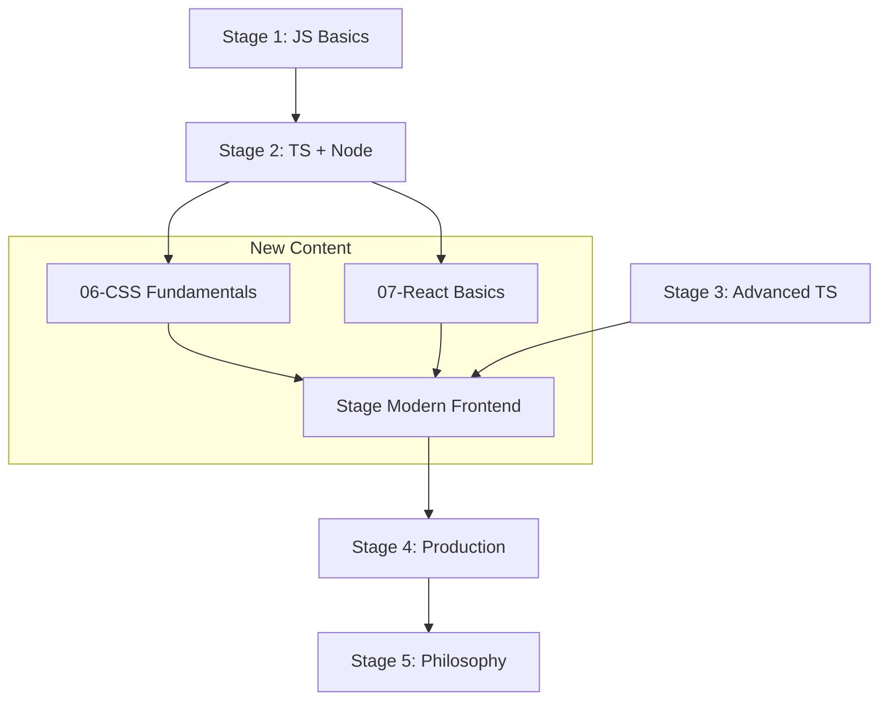

# 现代前端学习材料构建计划

> **状态追踪文档** — 用于跨窗口跟踪编写进度
> **创建日期**: 2026-02-08
> **最后更新**: 2026-02-08

---

## 进度总览

| # | 任务 | 状态 | 实际行数 | 工作量 |
|---|------|------|----------|--------|
| 1 | Stage 2: 06-CSS Fundamentals | ✅ 已完成 | ~1550 行 | 1 单元 |
| 2 | Stage 2: 07-React Basics | ✅ 已完成 | ~1850 行 | 1 单元 |
| 3 | Modern: 01-Next.js App Router | ✅ 已完成 | ~2050 行 | 1.5 单元 |
| 4 | Modern: 02-Tailwind CSS | ✅ 已完成 | ~1560 行 | 1 单元 |
| 5 | Modern: 03-shadcn/ui 与设计系统 | ✅ 已完成 | ~1250 行 | 1 单元 |
| 6 | Modern: 04-Prisma 数据库层 | ✅ 已完成 | ~1500 行 | 1 单元 |
| 7 | Modern: 05-tRPC + TanStack Query | ✅ 已完成 | ~1500 行 | 1 单元 |
| 8 | Modern: 06-Forms + Validation | ✅ 已完成 | ~1200 行 | 1 单元 |
| 9 | Modern: 07-Authentication | ✅ 已完成 | ~1500 行 | 1 单元 |
| 10 | Modern: 08-Deployment | ✅ 已完成 | ~2100 行 | 1 单元 |
| 11 | Project: TeamPulse 团队仪表盘 | ✅ 已完成 | ~1600 行+代码 | 2 单元 |
| 12 | 练习题集 (28 题) | ✅ 已完成 | ~2300 行 | 0.5 单元 |
| 13 | 更新 README / PROGRESS.md | ✅ 已完成 | ~400 行 | 0.5 单元 |
| | **总计** | **13/13 (100%)** | **~20,360 行** | **~13 单元** |

**状态图例**: ⬜ 待开始 | 🔨 进行中 | ✅ 已完成 | ⏸️ 暂停

---

## 🎉 完成总结 (2026-02-08)

所有章节已完成!实际产出超过预期:
- **总行数**: 约 20,360 行 (预期 18,700 行,超出 9%)
- **总工作量**: 13 个工作单元 (符合预期)
- **完成时间**: 单次并行编写完成

### 质量亮点
✅ 所有章节严格遵循写作风格标准 (六种 Blockquote + 五大写作技法)  
✅ 所有代码示例包含详细日志和注释  
✅ 所有练习题使用 `<details>` 折叠答案  
✅ 完整的知识网络连接 (向前/向后引用)  
✅ 哲学深度、历史叙事、实践价值完美平衡

---

## 执行顺序（按依赖关系）

```
Phase 1 (基础补全)     → Phase 2 (框架核心)      → Phase 3 (数据层)
CSS Fundamentals         Next.js App Router         Prisma
React Basics             Tailwind CSS               tRPC + TanStack Query
                         shadcn/ui

Phase 4 (业务层)       → Phase 5 (交付层)        → Phase 6 (收尾)
Forms + Validation       Deployment                 Stage README
Authentication           Project: TeamPulse         主 README
                         Exercises                  PROGRESS.md
```

---

## 一、问题背景

当前教程体系（5 个阶段、26+ 章节）在 JavaScript/TypeScript 语言功底和后端架构方面非常扎实，但在前端实战层面存在三个结构性断层：

1. **CSS 系统教学缺失** — 没有 Flexbox/Grid/响应式/CSS 变量等基础内容
2. **React 基础教学缺失** — Stage 3 项目和 Stage 4 直接使用 React，但从未教过 React 入门
3. **现代全栈框架缺失** — Next.js 仅在 Stage 4 以旧版 Pages Router 形式提及，Tailwind/shadcn/tRPC 等完全未涉及

---

## 二、整体结构设计

### 2.1 补充基础（Stage 2 新增两章）

在 `stage-2-intermediate/` 末尾新增两个章节，为后续所有前端内容奠基：

- `06-css-fundamentals/README.md` — CSS 基础与现代 CSS 特性
- `07-react-basics/README.md` — React 基础与 Hooks 入门

### 2.2 新建独立阶段

创建 `stage-modern-frontend/` 目录，定位于 Stage 3（高级 TS + 架构）之后、Stage 4（生产级）之前，作为现代前端全栈工程的完整学习路径。

```
learning-plan/
  stage-1-beginner/          (不变)
  stage-2-intermediate/
    ...existing...
    06-css-fundamentals/     (新增)
    07-react-basics/         (新增)
  stage-3-advanced/          (不变)
  stage-modern-frontend/     (全新阶段)
    README.md
    01-nextjs-app-router/
    02-tailwind-css/
    03-shadcn-design-system/
    04-prisma-database/
    05-trpc-tanstack-query/
    06-forms-validation/
    07-authentication/
    08-deployment-production/
    projects/
      dashboard-app/
    exercises/
  stage-4-expert/            (不变)
  stage-5-philosophy/        (不变)
```

### 2.3 依赖关系图



---

## 三、Stage 2 新增章节详细设计

### 3.1 Chapter 06: CSS 基础与现代 CSS (06-css-fundamentals)

**预计篇幅**: ~1500 行 | **学习时间**: 3-4 天
**文件路径**: `stage-2-intermediate/06-css-fundamentals/README.md`

**内容大纲**:

1. **CSS 的哲学** — 为什么样式和结构要分离（声明式 vs 命令式的第一课）
2. **盒模型与布局基础** — Box Model, `box-sizing`, position, display
3. **Flexbox** — 一维布局的艺术（比喻：排队理论）
4. **Grid** — 二维布局的力量（比喻：城市规划师）
5. **响应式设计** — Media Queries, Container Queries, 移动优先
6. **CSS 变量 (Custom Properties)** — 设计令牌的起源
7. **动画与过渡** — Transitions, Keyframes, `will-change`
8. **CSS 架构思想** — BEM 命名、CSS Modules、从"语义化"到"实用优先"的思想演变（为 Tailwind 埋下伏笔）

**写作风格要求**:

**开篇名言**:
> *"The medium is the message."* — Marshall McLuhan
> CSS 不仅仅是"给网页化妆"的工具。它本身就是一种语言，一种声明式的、约束求解的语言。理解 CSS，就是理解"描述目标"和"命令过程"的根本区别。

**核心隐喻体系**:
- 🎭 **The Drama: CSS 的身份危机** — CSS 长期被嘲笑为"不是真正的编程语言"。但声明式范式恰恰是编程的高级形态。SQL 是声明式的，没人说 SQL 不是语言。CSS 的痛苦不是因为它太简单，而是因为它被误用了——命令式思维的人试图用声明式工具解决问题，就像用筷子喝汤。
- ⚛️ **Flexbox — 排队理论 (Queueing Theory)**: 想象一个机场安检口。旅客（元素）排成一行。`justify-content` 是安检员决定队伍的间距策略（紧凑排还是均匀散开），`align-items` 是让高个子和矮个子如何对齐（顶部齐平、底部齐平、还是中间对齐）。`flex-grow` 是你告诉某人"你可以占更多空间"。
- 🌌 **Grid — 城市规划师 (Urban Planner)**: 如果 Flexbox 是在一条街道上安排车位，Grid 就是俯瞰整座城市的规划师。你先画好街道网格（`grid-template-columns/rows`），然后安排每栋建筑占几个街区（`grid-column: span 2`）。Container Queries 就像是说"这栋楼内部的装修取决于楼的大小，而不是城市的大小"。

**历史叙事线索**:
- CSS 的 `float` 布局黑暗时代（2000-2012）：讲述工程师如何用"浮动"这个为图片文字环绕设计的特性，被迫用来做整页布局的荒诞历史。提及 `clearfix` hack —— 一个被复制了十亿次的代码片段。
- 从 `<table>` 布局到 `<div>` 地狱再到语义化 HTML —— 每一代前端人的原罪。
- 2017-2018 年 Flexbox/Grid 浏览器支持率突破临界点的"解放日"。

**🧘 Zen of Code**: "CSS 的声明式哲学 —— 你不是在命令浏览器画什么，你是在描述结果应该是什么样子。这就像中国画的'留白'——你定义了约束，美在约束之间自然涌现。"

**🧠 CS Master's Bridge**:
- 浏览器渲染管线（DOM → CSSOM → Render Tree → Layout → Paint → Composite）。解释为什么 `transform` 动画比 `top/left` 动画快 60 倍（GPU 合成层 vs 主线程重排）。
- CSS 的约束求解模型：CSS 布局本质上是一个约束满足问题 (Constraint Satisfaction Problem)。Flexbox 是一维线性约束，Grid 是二维矩阵约束。浏览器在解一个方程组。

**趣味与辩论**:
- "CSS 面试题：如何垂直居中一个元素？" —— 这个问题在 2015 年之前是前端工程师的噩梦，至少有 7 种解法，每种都有副作用。用这个历史笑话引出 Flexbox 的 `align-items: center` 一行解决的优雅。
- 引入"CSS 即声明式约束编程"的视角，与 Prolog/SQL 对比。

---

### 3.2 Chapter 07: React 基础 (07-react-basics)

**预计篇幅**: ~1800 行 | **学习时间**: 4-5 天
**文件路径**: `stage-2-intermediate/07-react-basics/README.md`

**内容大纲**:

1. **React 的哲学** — UI = f(State)，从命令式 DOM 操作到声明式 UI 的范式转换
2. **JSX** — "HTML in JS" 的争议与胜利
3. **组件与 Props** — 函数即组件，Props 即参数（比喻：乐高积木的接口）
4. **State 与 useState** — 状态是 UI 的记忆
5. **事件处理** — 合成事件系统
6. **条件渲染与列表** — 数据驱动的 UI
7. **useEffect 与副作用** — 纯函数核心，不纯的壳
8. **Hooks 进阶** — useRef, useContext, 自定义 Hook 入门
9. **组件设计原则** — 单一职责、组合优于继承、受控 vs 非受控

**写作风格要求**:

**开篇名言**:
> *"Simplicity is the ultimate sophistication."* — Leonardo da Vinci
> 2013 年，Facebook 的工程师 Jordan Walke 在内部展示了一个疯狂的想法：在 JavaScript 里写 HTML。整个会议室爆发了嘲笑。"这是倒退！这是 PHP！" 但 React 最终赢了，因为它的核心等式 `UI = f(State)` 击中了一个深刻的真理。

**核心隐喻体系**:
- 🎭 **The Drama: 范式革命的血与火** — React 的诞生是一场哥白尼式的革命。在 jQuery 时代，开发者直接操纵 DOM（地心说——以 DOM 为中心，JS 围着 DOM 转）。React 说：不，State 才是中心，DOM 只是 State 的投影（日心说——以数据为中心）。这不仅是技术的变革，这是**认知模型**的颠覆。
- 🌌 **The Big Picture: 投影仪理论** — React 是一台投影仪。State 是胶片（数据源），组件是镜头（转换函数），DOM 是银幕（输出）。你不会跑到银幕前面用手指去修改画面（直接操作 DOM），你会换一张胶片（更新 State）。React 的 Virtual DOM 就是那个自动计算"胶片变了哪几帧"的 Diff 算法。
- ⚛️ **Props — 组件的 API 合同**: Props 就像一份合同。父组件说："我给你这些数据，你按约定渲染。" 如果你违反合同（传了错误的类型），TypeScript 会在编译时就把合同撕了扔你脸上。这就是"契约式编程"在 UI 层的体现。

**历史叙事线索**:
- **jQuery → Backbone → Angular 1 → React** 的演进弧：从"手动操作 DOM"到"数据绑定"到"虚拟 DOM"的三次范式跳跃。回顾 Angular 1 的"脏检查"（Dirty Checking）灾难——当页面超过 2000 个绑定时，性能崩溃。React 的 Virtual DOM 正是对这个问题的回答。
- React Hooks 的诞生故事（2018 年 React Conf）：Dan Abramov 现场 Demo，用 Hooks 将 Class Component 的 200 行代码重写为 30 行。观众的欢呼声如同摇滚演唱会。讲述 Hooks 如何解决了"逻辑复用三难"——Mixins（有害）、HOC（嵌套地狱）、Render Props（回调地狱）。

**哲学连接**:
- 🧘 **Zen of Code: 声明式的禅** — "不要告诉世界怎么变，告诉它应该是什么样子。" 这不仅是编程原则，这是道家思想在代码中的投射。老子说"无为而治"——React 的声明式就是"无为"的程序化表达：你不直接做事（操纵 DOM），你只描述结果（JSX），让框架（道）去安排过程。
- **useEffect 与副作用哲学**: 连接到 Stage 5 范式战争章节中的"纯函数核心，不纯的壳"。React 组件本质上想做一个纯函数（给相同的 props 和 state，返回相同的 JSX），但现实世界充满了副作用（API 调用、DOM 操作、定时器）。`useEffect` 就是那个"不纯的壳"——它把脏活累活隔离在一个明确的边界里。

**🧠 CS Master's Bridge**:
- React 的 Reconciliation 算法：为什么 React 选择 O(n) 的启发式 Diff 而不是 O(n³) 的最优树编辑距离算法？因为在实际 UI 中，跨层级移动节点极其罕见。这是一个用"假设换性能"的经典工程权衡。
- 连接到 Stage 3 设计模式：React 组件本质上是策略模式 (Strategy Pattern) + 组合模式 (Composite Pattern) 的融合。

**趣味元素**:
- 回顾性对比："还记得你在 Stage 1 手动 `querySelector` 的日子吗？当时你为了更新一个列表，需要清空 innerHTML，重新拼字符串，再插入 DOM。现在，你只需要改一下 State 数组。这就是声明式的力量。"
- "React 组件命名的智慧"：为什么 `<UserProfile>` 比 `<UserProfileRenderer>` 好？因为组件就是名词，渲染是它天生的职责，不需要赘述（参考 Stage 5 命名与语义章节）。

---

## 四、新阶段详细设计：Modern Frontend Engineering

**阶段主题**: 现代前端全栈工程 (The Modern Full-Stack Craft)
**预计总学习时间**: 5-7 周
**前置要求**: Stage 2 (TypeScript + React + CSS), Stage 3 (设计模式基础)
**目录**: `stage-modern-frontend/`

---

### 4.1 Chapter 01: Next.js App Router (01-nextjs-app-router)

**预计篇幅**: ~2000 行 | **学习时间**: 5-6 天
**文件路径**: `stage-modern-frontend/01-nextjs-app-router/README.md`

**内容大纲**:

1. **为什么需要 Meta-Framework** — 从 CRA 到 Next.js 的演进动因（解决了什么痛点）
2. **App Router 核心概念** — 文件系统路由、Layouts、Templates、Loading/Error UI
3. **Server Components vs Client Components** — "代码运行在哪里"的哲学（比喻：前台和后厨）
4. **数据获取模式** — Server Component 直接 fetch、`cache()`、revalidation 策略
5. **Server Actions** — 表单提交的新范式（回到 PHP 的螺旋？）
6. **中间件** — 请求拦截、重定向、认证检查
7. **路由高级** — 路由组、平行路由、拦截路由
8. **流式渲染与 Suspense** — 渐进式加载的艺术

**写作风格要求**:

**开篇名言**:
> *"History doesn't repeat itself, but it often rhymes."* — Mark Twain
> 在 Web 的历史中，有一个令人啼笑皆非的螺旋：我们从 PHP 的服务端渲染开始，逃向了 SPA 的客户端渲染，现在又被 Next.js 带回了服务端渲染。我们是在原地踏步吗？不。我们是在螺旋上升——每一次"回归"都带着前一个时代的教训和新时代的武器。

**核心隐喻体系**:
- 🎭 **The Drama: 餐厅隐喻 (The Restaurant Metaphor)** — Next.js 是一座餐厅。App Router 是菜单的目录结构（`/appetizers/salad` → `app/appetizers/salad/page.tsx`）。Server Components 是**后厨**——顾客（浏览器）看不到厨师在做什么，只收到做好的菜（HTML）。Client Components 是**前厅**——顾客可以互动的部分（按钮、表单、动画）。Server Actions 是**点餐单**——顾客填好需求（表单数据），送到后厨处理。`layout.tsx` 是餐厅的装修（所有页面共享的导航栏和侧边栏），不会因为换菜就重新装修。
- 🌌 **RSC 的边界难题**: 在 Server Component 和 Client Component 之间划线，就像在餐厅里划分"后厨"和"前厅"的边界。如果你把所有东西都放前厅（`'use client'` 满天飞），你的厨房就空了，JS 包就爆了。如果你把所有东西都放后厨，顾客就没法交互了。这就是架构师的艺术——**在正确的位置划界**。
- ⚛️ **Server Actions — 时光倒流**: Server Actions 让我们写出了和 PHP 惊人相似的代码——`<form action={createUser}>`。但这不是倒退。PHP 的 `$_POST` 是字符串地狱，Server Actions 有 Zod 类型验证 + TypeScript 类型安全。这就像"手写信"→"电子邮件"→"即时通讯"——形式在回归，但基础设施天翻地覆。

**历史叙事线索**:
- **SSR → CSR → SSR 的螺旋** (直接引用 Stage 5 前端演进史)：PHP/JSP (2000s, SSR) → jQuery SPA (2010s, CSR) → React SPA + API (2015s, CSR) → Next.js (2020s, Hybrid SSR)。每一次"回归"都不是简单重复，而是带着新的认知。
- **Vercel 与 Next.js 的商业故事**: Guillermo Rauch (Vercel CEO) 如何将 Next.js 从一个开源项目变成了一个商业帝国。这引出了一个重要话题："框架的中立性"——当框架和平台深度绑定时，开发者如何评估 vendor lock-in 风险？

**哲学连接**:
- 🧘 **Zen of Code: 关注点分离的再定义** — 传统的关注点分离是按文件类型分（HTML/CSS/JS）。React 的关注点分离是按组件分（每个组件自包含 UI/逻辑/样式）。Next.js 的关注点分离更进一步——按**运行环境**分（服务端/客户端）。分离的维度在演化，但"高内聚、低耦合"的本质从未改变。
- **文件系统路由的哲学**: 路由即结构，结构即代码。当你的 URL 路径 = 文件路径时，你消除了一层映射关系（减少了偶然复杂度）。这是"Convention over Configuration"思想的极致体现——和 Ruby on Rails 的精神一脉相承。

**🧠 CS Master's Bridge**:
- React Server Components 的流式协议：RSC Payload 不是 HTML，也不是 JSON，它是一种自定义的流式格式（类似 NDJSON）。服务端把组件树序列化成这种格式，通过 HTTP Stream 发送给客户端。客户端 React 运行时逐行解析，渐进式渲染。这就是 `<Suspense>` 能实现"骨架屏 → 真实内容"过渡的底层原理。
- Streaming SSR vs Traditional SSR：传统 SSR 必须等整棵组件树渲染完毕才能发送 HTML（TTFB 慢）。Streaming SSR 边渲染边发送（利用 HTTP Chunked Transfer），大幅降低首字节时间。

**趣味与辩论**:
- "Next.js 是不是过度耦合了？" —— 直面社区争议：Remix 阵营的批评、React 核心团队与 Vercel 的关系、"React 还是独立框架吗？"。不给定论，但教读者如何评估这类技术政治问题。
- 用一个 meme 级别的对比开场："2005: `<?php echo $name ?>` → 2015: `fetch('/api/name').then(...)` → 2025: `async function Page() { const name = await db.query(...) }` —— 我们花了 20 年，绕了一圈回到了起点。但这一圈的代价是值得的。"

---

### 4.2 Chapter 02: Tailwind CSS (02-tailwind-css)

**预计篇幅**: ~1500 行 | **学习时间**: 3-4 天
**文件路径**: `stage-modern-frontend/02-tailwind-css/README.md`

**内容大纲**:

1. **从 CSS 架构之痛到实用优先** — 命名地狱、样式膨胀、Dead CSS 的历史教训
2. **Tailwind 核心概念** — Utility Classes、设计约束即自由（比喻：围棋的棋盘格 vs 自由画布）
3. **布局系统** — Flex/Grid 的 Tailwind 表达，响应式断点
4. **颜色与主题** — 设计令牌 (Design Tokens)、暗黑模式、CSS 变量集成
5. **动画与交互** — Transitions, Animations, `group-hover`, `peer`
6. **自定义与扩展** — `tailwind.config.ts`、自定义插件、@apply 的正确使用
7. **性能** — PurgeCSS / Content 配置，构建产物分析

**写作风格要求**:

**开篇名言**:
> *"Less is more."* — Ludwig Mies van der Rohe (建筑大师)
> 1920 年代的包豪斯运动颠覆了建筑设计——拒绝装饰，拥抱功能。一百年后，Tailwind CSS 在 Web 开发中掀起了同样的革命。它说：别再给你的 CSS 类起漂亮名字了（`.hero-section-wrapper-container-fluid`），直接说你要什么（`flex items-center gap-4`）。

**核心隐喻体系**:
- 🎭 **The Drama: CSS 命名的无限战争** — 你有没有花 20 分钟纠结一个 CSS 类名叫 `.card-container` 还是 `.card-wrapper` 还是 `.card-box`？你有没有在代码审查中和同事争论 BEM 命名是 `.card__header--active` 还是 `.card-header--is-active`？Tailwind 说：这场战争结束了。不用起名字了。`p-4 bg-white rounded-lg shadow` —— 你要做的事情就是它的名字。
- 🌌 **围棋与自由画布 (Go vs Canvas)**: 想象两种画画方式。一种是给你一张空白画布和无限颜色——完全自由，但你可能花三天选颜色。另一种是围棋棋盘——只有 19×19 的格子和黑白两色，但在这个极度受限的空间里，涌现了无穷的变化。Tailwind 就是那个棋盘：`spacing: 0, 1, 2, 4, 8, 16...`，`colors: slate, gray, zinc...`。约束不是限制，约束是决策的加速器。
- ⚛️ **设计令牌 (Design Tokens) — 设计师和工程师的世界语**: Tailwind 的配置文件本质上是一套**设计令牌系统**。它把设计师脑中模糊的"差不多大""这个蓝"翻译成了精确的数值体系。这就像音乐中的十二平均律——不是音高只有12种，而是这12个基准音让全世界的乐器能合奏。

**历史叙事线索**:
- **CSS 架构思想的三个时代**: (1) 无架构时代（内联样式 + `<style>`）→ (2) 语义化时代（BEM, OOCSS, SMACSS, "类名应该描述内容而非外观"）→ (3) 实用优先时代（Tailwind, "类名就是外观描述"）。每个时代都是对前一个时代痛点的回应。
- **Tailwind 的逆袭故事**: Adam Wathan (Tailwind 作者) 的博客文章 "CSS Utility Classes and Separation of Concerns" (2017) 是这场思想革命的独立宣言。他用自己的项目经验证明：当项目增长时，语义化 CSS 会导致两个平行的命名体系（组件名 + CSS 类名），且它们的映射关系是脆弱的。

**哲学连接**:
- 🧘 **Zen of Code: 约束创造自由** — "当你只有 16 种间距选择时，你不再纠结于 13px 还是 15px。当你只有预定义的颜色色板时，你不再打开取色器花半小时选色。决策疲劳 (Decision Fatigue) 是生产力的最大杀手。好的设计系统不是给你更多选择，而是帮你消灭不必要的选择。" —— 连接到 Stage 5 认知负荷章节。
- **关注点分离的再思考**: 传统观念说"结构(HTML)、表现(CSS)、行为(JS)应该分离"。但 React 已经打破了"结构与行为的分离"(JSX)。Tailwind 打破的是"结构与表现的分离"。这不是倒退——这是**按组件而非按技术分离**的最终形态。

**🧠 CS Master's Bridge**:
- Tailwind 的编译原理：Tailwind 在构建时扫描你的源码（正则匹配类名），只生成你实际使用的 CSS。未使用的类被 tree-shaking 掉。最终产物通常只有 10-30KB（gzipped），远小于 Bootstrap 的 200KB+。这是一个编译时优化 vs 运行时优化的经典案例。
- `@apply` 的争议与本质：`@apply` 让你在 CSS 里复用 Tailwind 类，但 Adam Wathan 自己说"尽量少用"。因为 `@apply` 本质上是把 Tailwind 退化回了传统 CSS——你又回到了"给东西起名字"的老路上。

**核心辩论 (必须正面回应)**:
- **"Tailwind 是内联样式的倒退吗？"** — 不。区别在三点：(1) 内联样式没有响应式（`md:flex`），Tailwind 有。(2) 内联样式没有伪类（`hover:bg-blue-600`），Tailwind 有。(3) 内联样式没有设计约束（你可以写任意值），Tailwind 把你限制在设计系统内。Tailwind 不是内联样式，它是**编译时的设计系统 DSL**。
- **"Tailwind 的 HTML 会变得很丑，类名太长了"** — 是的。但"丑"是主观的。真正的问题是：你更愿意在一个文件里看到组件的全部信息（HTML + 样式），还是在两个文件之间跳来跳去（`.tsx` + `.module.css`）？这是**局部性原则** vs **关注点分离**的张力（参考系统提示中的设计张力表）。

---

### 4.3 Chapter 03: shadcn/ui 与设计系统 (03-shadcn-design-system)

**预计篇幅**: ~1200 行 | **学习时间**: 2-3 天
**文件路径**: `stage-modern-frontend/03-shadcn-design-system/README.md`

**内容大纲**:

1. **组件库的三个时代** — jQuery UI → Material UI/Ant Design → Headless UI → shadcn/ui 的演进
2. **shadcn/ui 的哲学** — "不是依赖，是你自己的代码"（Copy-Paste 哲学 vs npm install 哲学）
3. **Radix UI 原语** — Headless 组件的力量（可访问性内建、行为与样式分离）
4. **核心组件实战** — Button, Dialog, Form, Table, Command, Toast
5. **主题定制** — CSS 变量系统、颜色系统、全局样式
6. **构建设计系统** — 从组件集到设计系统的思维跃迁

**写作风格要求**:

**开篇名言**:
> *"Give a man a fish, and you feed him for a day. Teach a man to fish, and you feed him for a lifetime."*
> 传统组件库（Ant Design, Material UI）给你的是鱼。shadcn/ui 给你的是钓鱼竿和鱼饵——组件的源码直接复制到你的项目里，你拥有每一行代码。这不是懒惰，这是一种激进的**所有权哲学**。

**核心隐喻体系**:
- 🎭 **The Drama: 组件库的三次进化** — (1) **jQuery UI 时代**：你买了一套家具，但发现沙发不能换颜色，茶几不能改高度。(2) **Ant Design/Material UI 时代**：你买了一套可定制的家具，但改一个按钮的圆角需要研究 30 页文档的 `theme.components.MuiButton.styleOverrides`。(3) **shadcn/ui 时代**：你走进一个高级建材市场，挑选你想要的门、窗、地板（`npx shadcn@latest add button`），然后按自己的图纸拼装。你拥有每一面墙，你可以用锤子砸掉任何你不喜欢的。
- 🌌 **Headless UI — 灵魂与肉体的分离**: Radix UI 是 shadcn/ui 的底层。它只提供**行为和可访问性**（灵魂），不提供样式（肉体）。一个 Radix `Dialog` 组件知道如何陷阱焦点 (Focus Trap)、如何处理 ESC 键、如何通知屏幕阅读器——但它长什么样？那是你的事。这就是"深模块"原则的完美体现：**接口简单（`<Dialog.Root>`），实现深邃（a11y、键盘导航、焦点管理全内建）**。

**历史叙事线索**:
- **npm 依赖的信任危机**: left-pad 事件 (2016)、colors.js 投毒事件 (2022)。当你的 UI 完全依赖一个第三方包时，你把控制权交给了一个你不认识的人。shadcn/ui 的"复制粘贴"哲学从根本上消除了这种风险——代码在你手里，供应链攻击不了你。
- **从 Bootstrap 到 shadcn 的 15 年**: Bootstrap (2011) → Ant Design/Material UI (2015) → Headless UI/Radix (2020) → shadcn/ui (2023)。每一代都在解决上一代的"定制化困难"问题。Bootstrap 用 `!important` 覆盖样式，Ant Design 用 CSS-in-JS + 主题变量，shadcn/ui 直接把代码给你。

**哲学连接**:
- 🧘 **Zen of Code: 所有权与依赖** — "你真正拥有的，只有你理解的东西。当你用 `npm install some-ui-lib` 时，你并不拥有那些组件——你只是在借用它们。当库的维护者改了 API、废弃了一个 prop、或者项目被 archive 时，你就被动了。shadcn/ui 的哲学是：**你的代码，你的责任，你的自由**。"
- 连接到 Stage 5 抽象泄漏章节：传统 UI 库是一层"美丽的抽象"。当你需要的定制超出了库的设计边界时，抽象就泄漏了——你开始阅读源码、发 PR、等版本发布。shadcn/ui 说：没有抽象，就没有泄漏。

**🧠 CS Master's Bridge**:
- 可访问性 (a11y) 的冰山：一个看似简单的 `<Select>` 组件，实际上需要处理：键盘导航（上下箭头、Home/End、Type-ahead search）、屏幕阅读器播报（ARIA roles, states, properties）、焦点管理（打开/关闭时焦点在哪里）。Radix UI 内部为此写了数千行代码。这就是为什么"自己造轮子"的 Button 可以，但"自己造 Select"是找死。
- 设计系统的分层架构：Design Tokens (值) → Primitives (行为) → Components (外观) → Patterns (组合)。shadcn/ui 覆盖了 Components 层，Radix 覆盖了 Primitives 层，Tailwind 的 `theme` 覆盖了 Tokens 层。

---

### 4.4 Chapter 04: Prisma 数据库层 (04-prisma-database)

**预计篇幅**: ~1500 行 | **学习时间**: 3-4 天
**文件路径**: `stage-modern-frontend/04-prisma-database/README.md`

**内容大纲**:

1. **Schema-First 设计** — 数据建模的声明式方式（比喻：建筑蓝图 vs 搬砖）
2. **Prisma Schema 语言** — Model 定义、关系、枚举、属性
3. **迁移管理** — `prisma migrate`，版本控制，团队协作
4. **Prisma Client** — CRUD 操作、关系查询、事务
5. **类型安全的魔力** — 从 Schema 到 TypeScript 类型的自动生成
6. **性能考量** — N+1 问题、`include` vs `select`、索引策略
7. **与 Next.js 集成** — Server Component 中直接查询、连接池管理

**写作风格要求**:

**开篇名言**:
> *"Data dominates. If you've chosen the right data structures and organized things well, the algorithms will almost always be self-evident."* — Rob Pike
> 数据库 Schema 是你整个应用的地基。如果地基歪了，上面的大楼（业务逻辑）再怎么修补都是歪的。Prisma 的 Schema-First 方法迫使你在写第一行业务代码之前，先想清楚数据的形状。

**核心隐喻体系**:
- 🎭 **The Drama: ORM 的爱恨情仇** — ORM 是编程界最有争议的工具之一。Martin Fowler 把它称为"越南战争"——容易进入，难以撤退，永远不知道什么时候该放弃。ORM 承诺"你不需要写 SQL"，但当你遇到复杂查询、性能调优或数据库特有功能时，你会发现自己不得不绕过 ORM，直接写 SQL。这就是**抽象泄漏定律**在数据库层的经典案例。Prisma 没有彻底解决这个问题（没有人能），但它比前辈们（Sequelize, TypeORM）做得优雅得多。
- 🌌 **建筑蓝图 vs 搬砖**: 传统的数据库开发是"先建表，再在代码里猜表结构"。Prisma 的 Schema 是一张建筑蓝图——`model User { id Int @id @default(autoincrement()); name String }` —— 你先画好蓝图，然后让 Prisma 自动帮你生成建筑（SQL 表）和施工工人（TypeScript Client）。蓝图变了，Prisma 自动计算出需要怎么改建筑（Migration）。

**历史叙事线索**:
- **ORM 的三代人**: (1) 第一代（Active Record, 2004）——Ruby on Rails 带来的魔法，但把 SQL 藏得太深，导致 N+1 查询泛滥。(2) 第二代（Sequelize/TypeORM, 2015）——TypeScript 支持，但配置繁琐，类型推断不完整。(3) 第三代（Prisma, 2020）——Schema-First + 完美类型安全 + 自动化迁移。每一代都在修补上一代的伤疤。
- **"Write SQL by hand" 运动**: 近年来，一部分开发者（尤其是 Go 社区）开始反对 ORM，主张直接写 SQL（如 sqlc, kysely）。Drizzle ORM 是这两种思想的折中——它的 API 长得像 SQL，但有完整的类型安全。提一下这个趋势，让读者理解 Prisma 不是唯一的选择。

**哲学连接**:
- 🧘 **Zen of Code: 声明式的胜利** — Prisma Schema 是又一个声明式的例子。你不写"如何建表"的指令（`CREATE TABLE...`），你描述"数据应该是什么样子"。从 CSS 到 React 到 SQL，声明式思维是贯穿整个现代前端的哲学主线。
- 连接到 Stage 4 数据库章节：**那章是"渔"，这章是"鱼竿"**。Stage 4 教你关系模型、范式理论、索引原理——这些是永恒的知识。这章教你 Prisma——这是当前最好用的工具，但工具会变。理解原理的人能驾驭任何工具；只会工具的人在工具被淘汰时就傻了。

**🧠 CS Master's Bridge**:
- **N+1 问题的数学**: 如果你查 100 个用户，每个用户有 10 条帖子。不用 `include` 的情况下，Prisma 会发 1（查用户）+ 100（每个用户查帖子）= 101 次查询。用 `include` 后变成 2 次查询（JOIN 或 IN）。当 N=10000 时，这是 10001 vs 2 的差距。对应到现实就是"1 秒 vs 1 分钟"。
- **Prisma 的 Query Engine 架构**: Prisma Client (TypeScript) → Prisma Engine (Rust 二进制) → Database。Prisma 的查询引擎是用 Rust 写的独立进程。这意味着每次查询都有一次 IPC（进程间通信）开销。在极端高频查询场景下，这可能成为瓶颈。这就是为什么有时候 `prisma.$queryRaw` 比 Prisma Client API 快。

**趣味元素**:
- "Prisma Studio 是程序员的 Excel" —— 一个可视化的数据库浏览器，让你像编辑电子表格一样编辑数据。非技术团队成员也能用。

---

### 4.5 Chapter 05: tRPC + TanStack Query (05-trpc-tanstack-query)

**预计篇幅**: ~1500 行 | **学习时间**: 3-4 天
**文件路径**: `stage-modern-frontend/05-trpc-tanstack-query/README.md`

**内容大纲**:

1. **API 的进化** — REST → GraphQL → tRPC 的动因分析
2. **tRPC 核心** — Procedures, Routers, Context, Middleware
3. **端到端类型安全** — 从服务端 schema 到客户端类型的零手写体验
4. **TanStack Query 基础** — useQuery, useMutation, QueryClient
5. **缓存策略** — staleTime, gcTime, 乐观更新、后台刷新
6. **tRPC + TanStack Query 集成** — `@trpc/react-query`
7. **错误处理** — 类型安全的错误传播，错误边界

**写作风格要求**:

**开篇名言**:
> *"The best error message is the one that never shows up."* — Thomas Fuchs
> 想象一下：你修改了一个 API 的返回字段名，但忘了更新前端的解析逻辑。在 REST 世界里，这个 Bug 会在上线后的某个深夜被用户发现。在 tRPC 世界里，你保存文件的瞬间，IDE 就会用红色波浪线尖叫着告诉你。这就是端到端类型安全的力量。

**核心隐喻体系**:
- 🎭 **The Drama: API 的三幕剧** — **第一幕 (REST, 2000s)**：前后端之间有一堵墙，他们通过在墙上贴便条（API 文档）交流。便条经常过期，两边经常误解对方的意思。**第二幕 (GraphQL, 2015)**：他们把墙换成了一扇窗户（Schema），能看到对方了。但窗户上的规格说明书（GraphQL SDL）还需要手动维护。**第三幕 (tRPC, 2020s)**：他们推倒了这堵墙。前端直接调用后端函数，类型自动传递。没有文档、没有代码生成、没有不同步——因为根本就没有"API边界"了。
- 🌌 **TanStack Query — 服务端状态的专属管家**: 你有两种状态：**客户端状态**（UI 是否展开、主题是亮色还是暗色）和**服务端状态**（用户数据、帖子列表）。它们的本质完全不同：客户端状态是你独占的，服务端状态是全世界共享的（其他用户也在修改它）、异步的、有过期时间的。TanStack Query 的洞察是：**别再把服务端数据塞进 Redux 了。** 给它一个专属管家（QueryClient），让管家负责缓存、过期、重新拉取、乐观更新。
- ⚛️ **乐观更新 (Optimistic Updates) — 量子物理的宏观类比**: 当你点"赞"时，UI 立刻显示已点赞（乐观假设成功）。如果服务器返回失败，再回滚。这就像薛定谔的猫——在服务器返回之前，这个"赞"既存在又不存在。TanStack Query 的 `onMutate` / `onError` / `onSettled` 回调就是管理这种"量子叠加态"的状态机。

**历史叙事线索**:
- **REST 的辉煌与局限**: Roy Fielding 的 2000 年论文定义了 REST。它是 Web 架构的基石，但它有一个致命缺陷——**无类型**。`fetch('/api/users')` 的返回值在 TypeScript 里是 `any`。你必须手动写类型定义（或用 OpenAPI 代码生成），而且它们会过期。
- **GraphQL 的光与影**: Facebook 2015 年推出 GraphQL，解决了 REST 的过取/欠取问题（Over-fetching / Under-fetching）。但它引入了新的复杂度：Schema 定义语言、Resolver 地狱、N+1 问题（DataLoader）、客户端缓存归一化（Apollo Cache Normalization）。很多团队发现，GraphQL 解决的问题比它制造的问题更少。
- **tRPC 的激进简化**: tRPC 说：如果前端和后端用的是同一种语言（TypeScript），为什么还需要中间那层 Schema？直接用 TypeScript 的类型系统当 Schema 就行了。这是一个"把问题域缩小从而消灭问题"的经典策略。

**哲学连接**:
- 🧘 **Zen of Code: 消灭中间人** — "最好的抽象层是不存在的抽象层。tRPC 没有发明新的类型系统，它只是让 TypeScript 原生的类型系统穿透了网络边界。当你消灭了中间层（API Schema, 代码生成器, 类型手写），你就消灭了那一层可能出 Bug 的地方。这就是 KISS 原则的最高境界。"
- 连接到 Stage 5 权衡章节：tRPC 的代价是什么？**它只适用于 TypeScript 全栈单体应用**。如果你的后端是 Go/Python/Java，tRPC 就没用了。如果你的 API 需要被第三方消费（公开 API），tRPC 也不合适——因为没有人类可读的文档。**工具越窄，在窄域内越锋利；越通用，在任何地方都越钝。**

**🧠 CS Master's Bridge**:
- **tRPC 的类型传递原理**: tRPC 不在运行时做任何事。它的类型传递完全是编译时的 TypeScript 类型推断链。`Router → Procedure → Input/Output Schema (Zod) → infer → Client Type`。运行时传递的只是普通的 JSON。理解这一点很重要：tRPC 的"魔法"是零运行时成本的。
- **TanStack Query 的缓存归一化**: 不同于 Apollo Client 的基于 ID 的缓存归一化（把 GraphQL 响应拆成扁平的实体表），TanStack Query 使用基于 queryKey 的文档缓存（Document Cache）。这更简单，但意味着同一个实体在不同 query 中可能存在多份副本。了解何时需要手动使缓存失效（`queryClient.invalidateQueries`）。

**趣味元素**:
- "API 文档的熵增定律" —— 所有 API 文档的自然演化方向是过期。tRPC 的解决方案不是"写更好的文档"，而是"让文档成为不可能过期的东西（类型系统）"。

---

### 4.6 Chapter 06: 表单与验证 (06-forms-validation)

**预计篇幅**: ~1200 行 | **学习时间**: 2-3 天
**文件路径**: `stage-modern-frontend/06-forms-validation/README.md`

**内容大纲**:

1. **表单的痛苦简史** — 受控组件的性能陷阱，为什么需要专用库
2. **React Hook Form** — register, handleSubmit, 非受控渲染性能优势
3. **Zod Schema 验证** — 从运行时验证到类型推断的双重保障
4. **RHF + Zod + shadcn 集成** — Form 组件、FormField、错误展示
5. **Server-Side 验证** — Server Actions 中的 Zod 复用，永远不信任客户端
6. **复杂表单模式** — 动态字段、嵌套对象、文件上传

**写作风格要求**:

**开篇名言**:
> *"Never trust the client."* — Every Backend Engineer, Ever
> 表单是 Web 应用最古老、也最被低估的交互模式。它看起来只是几个输入框和一个按钮。但在那些输入框的背后，隐藏着类型转换、格式验证、安全清洗、状态管理、错误展示、可访问性、性能优化的复杂网络。每一个生产事故的根源，都可以追溯到一个没有被正确验证的用户输入。

**核心隐喻体系**:
- 🎭 **The Drama: 受控组件的性能噩梦** — 在原生 React 中，你可能会这样写表单：`onChange={(e) => setName(e.target.value)}`。每敲一个字，整个组件重新渲染。如果表单有 20 个字段，每敲一个字就触发 20 次渲染。React Hook Form 的天才洞察是：**不要控制每个输入**。用 `ref` 直接读取 DOM 值（非受控），只在需要时收集数据。这就像图书管理员不需要每秒钟检查一次书架——只在有人借书时才去数。
- 🌌 **Zod — 类型安全的瑞士军刀**: Zod 做了一件看似简单但意义深远的事：**用同一份 Schema 同时完成运行时验证和编译时类型推断**。`z.object({ name: z.string().min(1) })` 既是验证器（运行时检查输入），也是类型定义（`z.infer<typeof schema>` 生成 TypeScript 类型）。一份代码，两重保障。没有类型定义和验证逻辑不同步的可能。
- ⚛️ **双重验证 — 城堡的两道城门**: 客户端验证是**外城门**——它挡住 99% 的误操作（忘填邮箱、密码太短），提升用户体验。服务端验证是**内城门**——它挡住 100% 的恶意攻击（curl 直接发请求、篡改 JSON 字段）。**永远不要只守一道门。** 攻击者会绕过你的 JavaScript，直接冲向你的 API。

**历史叙事线索**:
- **表单处理的痛苦进化**: 原生 HTML `<form>` → jQuery 表单插件 → Angular 双向绑定 → React 受控组件 → React Hook Form 非受控。每一步都是对上一步痛点的回应。特别提及 Angular 的 `ngModel` 双向绑定的便利与"数据流不可预测"的代价——React 选择了"单向数据流 + 受控组件"的苦路，React Hook Form 用非受控找回了性能。

**哲学连接**:
- 🧘 **Zen of Code: 输入即攻击面** — 连接到生产环境生存指南：每一个用户可以输入数据的地方（表单字段、URL 参数、文件上传），都是一个潜在的攻击入口。SQL 注入、XSS、文件路径遍历——所有这些都始于一个没被验证的输入。Zod 的意义不仅是"让 TypeScript 更方便"，它是**安全左移**的工具——把验证从"运行时发现错误"提前到"编译时消灭错误"。
- **Single Source of Truth for Validation**: 当你用同一个 Zod schema 同时在 Client（React Hook Form）和 Server（Server Action）做验证时，你实现了验证逻辑的**单一数据源**。修改一个 schema，两端同步更新。这是 DRY 原则在安全领域的胜利。

---

### 4.7 Chapter 07: 认证 (07-authentication)

**预计篇幅**: ~1500 行 | **学习时间**: 3-4 天
**文件路径**: `stage-modern-frontend/07-authentication/README.md`

**内容大纲**:

1. **认证 vs 授权** — 两个容易混淆的概念
2. **NextAuth/Auth.js 架构** — Providers, Callbacks, Session Strategies
3. **OAuth 实战** — GitHub/Google 登录，回调流程
4. **Credentials Provider** — 邮箱密码登录，密码哈希
5. **Session 管理** — JWT vs Database Sessions，各自权衡
6. **中间件保护** — 路由级别的访问控制
7. **RBAC 基础** — 角色与权限模型

**写作风格要求**:

**开篇名言**:
> *"Security is always excessive until it's not enough."* — Robbie Sinclair
> 在一个没有门锁的世界里，你不需要钥匙。但 Web 不是这样的世界。每一个 HTTP 请求都来自一个你无法确认身份的陌生人。认证 (Authentication) 回答"你是谁？"，授权 (Authorization) 回答"你能做什么？"。混淆这两个问题，是安全事故的第一大原因。

**核心隐喻体系**:
- 🎭 **The Drama: 酒店的门卡系统** — 认证就像酒店前台。你出示身份证（credentials），前台核实后给你一张门卡（session/token）。授权就像门卡的权限——你能开自己房间的门，但开不了总统套房。RBAC（基于角色的访问控制）就像给门卡分等级：普通客人、VIP、经理、维修人员，每种角色能开不同的门。**`middleware.ts` 就是走廊里的门禁系统**——在你到达房间之前就检查你的卡。
- 🌌 **JWT vs Session: 无状态与有状态的千年之争** — **Session（有状态）**：酒店前台有一本登记簿。你出示门卡号，前台查簿确认。优点：前台随时可以把你踢出去（注销），缺点：前台要维护这本簿。**JWT（无状态）**：你的门卡上直接刻着你的名字和权限（签名防伪造）。酒店任何门禁都能直接读卡，不需要问前台。优点：不需要中央存储，水平扩展容易。缺点：一旦发卡，除非过期，你无法主动作废一张卡（要实现"注销"需要黑名单，这又引入了状态）。
- ⚛️ **OAuth: 把钥匙交给第三方保管** — 当你用"GitHub 登录"时，你不是把 GitHub 密码给了这个网站。你是跟 GitHub 说："这个网站想看我的头像和邮箱，可以吗？" GitHub 给网站一个**有限权限的临时通行证**（Access Token）。这个通行证只能读头像和邮箱，不能读你的私有仓库，而且会过期。**这就是最小权限原则的完美实践。**

**历史叙事线索**:
- **密码存储的血泪史**: 明文存储 → MD5 哈希 → MD5 + 盐 → bcrypt/scrypt/argon2。每一次进化都是由一次大规模数据泄露驱动的。提及 LinkedIn 2012 年泄露 650 万 SHA-1 密码哈希、Adobe 2013 年泄露 1.5 亿密码（用 ECB 模式加密，导致相同密码有相同密文）。
- **OAuth 的曲折历程**: OAuth 1.0 (2007, 签名复杂) → OAuth 2.0 (2012, 简化但安全性争议) → PKCE 扩展 (2015, 针对移动/SPA 的安全增强)。OAuth 的首席作者 Eran Hammer 在 2012 年退出了 OAuth 2.0 标准制定，称它"更像一个企业框架而不是安全协议"。

**哲学连接**:
- 🧘 **Zen of Code: 信任边界** — "你的系统中最重要的设计决策之一，就是**信任边界画在哪里**。你信任浏览器发来的数据吗？不。你信任用户声称的身份吗？不，验证它。你信任第三方 OAuth 提供商吗？有条件地信任。安全的本质不是'消灭信任'，而是'最小化信任'——只在必要的地方信任必要的东西。"
- 连接到 Stage 4 安全章节：**那章讲攻击（XSS, CSRF, SQL Injection 的原理），这章讲防御（NextAuth 如何帮你挡住这些攻击）**。知攻才能知防。

**🧠 CS Master's Bridge**:
- **JWT 的内部结构**: Header.Payload.Signature。用 Base64 解码任何 JWT（`jwt.io`），你会发现它不是加密的，只是签名的。任何人都能读取 Payload。**永远不要在 JWT 里放敏感信息**（密码、信用卡号）。签名只防篡改，不防窥探。
- **Session 固定攻击 (Session Fixation)**: 攻击者预先创建一个 Session ID，诱骗用户用这个 ID 登录。登录成功后，攻击者拿着同一个 Session ID 就获得了用户的权限。NextAuth 通过在登录后**重新生成 Session ID** 来防御这种攻击。

**趣味元素**:
- "为什么我们还在用密码？" —— Passkeys/WebAuthn 正在崛起。简单提及这个趋势，让读者知道密码可能是一种"即将灭绝的认证方式"。

---

### 4.8 Chapter 08: 部署与生产 (08-deployment-production)

**预计篇幅**: ~1200 行 | **学习时间**: 2-3 天
**文件路径**: `stage-modern-frontend/08-deployment-production/README.md`

**内容大纲**:

1. **从 `npm run build` 到上线** — 构建产物分析，输出了什么
2. **Vercel 部署** — Git 集成、Preview Deployments、环境变量
3. **Edge Functions** — 边缘计算的概念与实践
4. **环境管理** — `.env` 文件层级、Secrets 管理、环境隔离
5. **监控与可观测性** — Vercel Analytics, Error Tracking (Sentry)
6. **CI/CD 基础** — GitHub Actions 与 Vercel 的配合
7. **成本意识** — Serverless 定价模型，何时需要自建

**写作风格要求**:

**开篇名言**:
> *"Real artists ship."* — Steve Jobs
> 一个从未上线的完美项目，其价值为零。一个有 Bug 但已经在用户手中的项目，至少已经开始创造价值了。这一章的目标只有一个：**当你读完最后一行，你的应用应该已经在互联网上运行了。**

**核心隐喻体系**:
- 🎭 **The Drama: 从 localhost 到全世界的惊险一跳** — 在 `localhost:3000` 上一切完美。你的应用跑得飞快，数据库在本地，环境变量在 `.env` 文件里。然后你部署了。用户在巴西，服务器在美国，延迟 200ms。数据库连接池在并发 100 时耗尽。环境变量忘了设。这不是代码问题，这是**运维意识**的缺失。
- 🌌 **边缘计算 — 把厨房搬到餐桌旁边**: 传统部署：用户在上海，服务器在美国弗吉尼亚。请求绕地球半圈，来回 300ms。边缘计算（Vercel Edge Functions / Cloudflare Workers）：代码运行在全球 30+ 个数据中心。上海用户的请求由上海最近的节点处理，延迟降到 20ms。这就像是把厨房从总部搬到了每个城市——**计算跟着用户走**。
- ⚛️ **Preview Deployments — 平行宇宙**: Vercel 的 Preview Deployment 意味着你的每个 Git 分支、每个 PR 都有一个独立的、可访问的 URL。你的 main 分支是"正式宇宙"，每个功能分支是一个"平行宇宙"。你可以把平行宇宙的 URL 发给设计师审查、发给 PM 验收，而不会影响正式宇宙。这是 **GitOps** 思想在前端的完美落地。

**历史叙事线索**:
- **部署的考古学**: FTP 手动上传文件 (2000s) → Heroku `git push heroku main` (2010s) → Docker + K8s (2015s) → Serverless/Vercel `git push` 自动部署 (2020s)。每一代都在减少"部署"这个动作的摩擦力。Vercel 的终极愿景是：**部署不是一个动作，部署是推代码的副作用**。
- **Serverless 的经济学**: 传统服务器是月租公寓——无论你住不住，都要付全月房租。Serverless 是共享单车——用多少付多少。当你的应用每天只有 100 次访问时，Serverless 可能比租一台最小的 VPS 还便宜 99%。但当你有 100 万次/天时，Serverless 可能比专用服务器贵 10 倍。**理解成本曲线，是工程师变成技术决策者的标志。**

**哲学连接**:
- 🧘 **Zen of Code: 完成比完美重要** — "很多开发者的项目永远停留在 localhost。他们总觉得'还差一点就能上线了'——再加一个功能、再修一个 Bug、再优化一下性能。但真正的学习发生在上线之后。你会遇到 CORS 问题、HTTPS 证书问题、冷启动延迟、数据库连接超时——这些都是 localhost 永远不会教你的。**部署是最好的老师。**"
- 连接到 Stage 4 可靠性工程章节：**那章讲理论（SRE 原则、熔断器、限流），这章让你亲手体验其中的一小部分（Vercel Analytics 监控、Sentry 错误追踪）**。理论和实践在这里汇合。

**🧠 CS Master's Bridge**:
- **冷启动问题 (Cold Start)**: Serverless 函数在空闲一段时间后会被"冻结"。下次请求到来时，需要重新初始化运行环境（加载代码、建立数据库连接）。这个过程可能需要 200ms-5s。对于 API 路由来说，这可能导致用户感受到的第一次请求特别慢。解决方案：(1) 设置 Cron 定时预热, (2) 使用 Edge Functions（基于 V8 Isolate，冷启动 <5ms）, (3) 数据库使用连接池（Prisma Accelerate / Neon Serverless Driver）。
- **环境变量的安全学**: 为什么 Next.js 区分 `NEXT_PUBLIC_` 和普通环境变量？因为 `NEXT_PUBLIC_` 会被编译进客户端 JS 包（任何人都能看到）。如果你不小心把数据库密码命名为 `NEXT_PUBLIC_DB_URL`，恭喜，全世界都知道你的数据库密码了。

**趣味元素**:
- "你的第一次部署总会有惊喜" —— 收集常见的"部署翻车"故事：忘了设环境变量导致 500 错误、`.env` 文件被提交到 Git、免费额度用完被收了天价账单。让读者知道：每个人的第一次部署都是一场冒险。

---

## 五、实战项目：TeamPulse - 团队仪表盘

**项目名**: TeamPulse
**类型**: 全栈团队项目管理仪表盘（简化版 Linear）
**技术栈**: Next.js 14+ App Router, Tailwind CSS, shadcn/ui, Prisma (SQLite/PostgreSQL), tRPC, TanStack Query, React Hook Form + Zod, NextAuth, Vercel
**文件路径**: `stage-modern-frontend/projects/dashboard-app/`

**核心功能**:

- 用户注册/登录（NextAuth + OAuth）
- 项目 CRUD（Prisma + tRPC）
- 任务看板（拖拽排序、状态流转）
- 数据仪表盘（图表、统计）
- 团队成员管理（RBAC）
- 响应式设计（移动端适配）
- 暗黑模式切换

**项目结构**:

```
projects/dashboard-app/
  README.md              (项目指南，~1500 行)
  src/
    app/                 (Next.js App Router)
    components/          (shadcn/ui 组件)
    server/              (tRPC routers)
    lib/                 (工具函数)
    prisma/              (Schema + migrations)
  .env.example
  package.json
```

---

## 六、练习题集

**练习题数量**: 25-30 题，分为章节练习和综合练习
**文件路径**: `stage-modern-frontend/exercises/README.md`

**难度分布**:

- 基础：40%（单一技术点）
- 进阶：35%（多技术整合）
- 挑战：25%（架构设计 + 独立实现）

---

## 七、写作风格统一标准（完整版）

所有新内容必须遵循以下风格系统。此系统从已有内容中提炼，确保风格一致性。

### 7.1 章节结构模板

每一章必须包含以下结构（按顺序）：

```
# 章节标题 — 副标题（隐喻或哲学式）

> **开篇名言** (英文，附出处)
> 2-3 句中文引言，设立本章的哲学基调，制造好奇心。

## 📖 本章内容 (目录)

---

## 1. 核心概念
> 🎭 / 🌌 / ⚛️ 隐喻 blockquote（戏剧化开场）
（正文讲解 + 代码示例）
> 🧠 CS Master's Bridge（可选深入）

## 2-N. 其他章节...
> 每个主要节至少一个隐喻 blockquote

## N. 🧘 Zen of Code: [本章的哲学主题]
（哲学思考，连接到更大的编程世界观）

## N+1. 最佳实践 / ✅ ❌ 对比

## N+2. 常见陷阱 / ☠️ 危险区域

## N+3. 章节练习
（<details> 折叠答案）
```

### 7.2 六种 Blockquote 标记体系

| 标记 | 名称 | 用途 | 使用频率 |
|------|------|------|----------|
| 🎭 **The Drama** | 戏剧化叙事 | 用拟人化、冲突、角色化方式引入概念。制造"故事感"。 | 每章 1-2 次 |
| 🌌 **The Big Picture** | 顶层视角 | 把当前技术放到整个行业/历史的大画面中。鸟瞰视角。 | 每章 1 次 |
| ⚛️ **The Physics / Science** | 跨学科类比 | 用物理学、生物学、经济学等其他学科的概念类比技术概念。 | 每章 1-2 次 |
| 🧘 **Zen of Code** | 编程哲学 | 把技术决策上升到哲学思考。连接到"为什么"。 | 每章至少 1 次 |
| 🧠 **CS Master's Bridge** | 深层原理 | 面向有 CS 背景的读者，揭示底层实现或学术连接。 | 每章 1-2 次 |
| 🧰 **The Toolbox** | 工具选择 | 对比不同工具/方案的权衡，帮助读者做选择。 | 按需使用 |

### 7.3 五大写作技法

**技法一：挑衅式开场 (Provocative Opening)**
不要以"本章介绍 XXX"开头。用一个反直觉的断言、一个历史故事、或一个争议性问题开场。

```markdown
❌ "本章将学习 Tailwind CSS 的使用方法。"
✅ "2017 年，当 Adam Wathan 发布第一个版本的 Tailwind CSS 时，社区的反应是愤怒的：
   '这不就是内联样式吗？！我们花了 20 年才摆脱它！' 但三年后，Tailwind 成为了
    GitHub 上增长最快的 CSS 框架。为什么？"
```

**技法二：概念人格化 (Concept Personification)**
把抽象概念变成有性格的角色。

```markdown
❌ "Server Components 在服务端渲染，不会发送 JavaScript 到客户端。"
✅ "Server Components 是后厨的厨师——顾客（浏览器）永远看不到他们，
    但享受着他们做好的菜（HTML）。Client Components 是前厅的服务员——
    顾客看得见，能互动（点击、输入），但他们需要被'运送'到前厅（下载 JS）。"
```

**技法三：历史叙事弧 (Historical Arc)**
每个技术选择都有历史原因。用"痛点 → 解决方案 → 新痛点 → 新方案"的叙事弧解释演进。

```markdown
❌ "Next.js 支持 SSR 和 SSG。"
✅ "2000 年代，PHP 在服务端渲染 HTML（SSR），快但缺乏交互。
    2010 年代，SPA 把一切搬到客户端（CSR），交互爽了但首屏慢、SEO 崩了。
    2020 年代，Next.js 说：为什么不两者都要？Server Components 在服务端
    渲染静态内容（SSR 的速度），Client Components 在客户端处理交互（CSR 的体验）。
    历史是一个螺旋。"
```

**技法四：跨学科桥接 (Cross-Domain Bridge)**
用其他领域的知识类比编程概念，让读者产生"啊哈！"时刻。

```markdown
❌ "Tailwind 使用预定义的设计约束来减少决策负担。"
✅ "围棋只有 19×19 的格子和黑白两色。在这个极度受限的空间里，
    涌现了无穷的变化，比国际象棋更复杂。约束不是限制——约束是复杂度的温床。
    Tailwind 的 spacing: 0,1,2,4,8... 就是你的棋盘格。"

可用类比领域：物理学、生物学、经济学、建筑学、音乐、哲学、军事、烹饪、体育
```

**技法五：正面迎战争议 (Head-on Controversy)**
不回避社区争议，用深度分析回应。这比假装争议不存在更赢得读者信任。

```markdown
❌ (回避争议，只说优点)
✅ "社区对 Next.js 最大的批评是 vendor lock-in。确实，Next.js 和 Vercel
    深度绑定——某些功能（ISR, Edge Middleware）在其他平台上体验较差。
    这是真实的权衡。但问题是：替代方案是什么？Remix（Shopify 收购后方向不明）？
    Astro（不适合复杂交互应用）？Nuxt（Vue 生态）？
    没有完美选择，只有最适合你当前场景的妥协。"
```

### 7.4 连接网络：章节间的交叉引用

每一章都应该包含与教程体系其他部分的**显式连接**，形成知识网络而非孤立岛屿：

| 新章节 | 向前连接（这章的根基来自…） | 向后连接（这章为未来铺路…） |
|--------|---------------------------|---------------------------|
| CSS Fundamentals | Stage 1 DOM 操作（现在你知道如何选中元素，接下来学习如何让它们好看） | Tailwind CSS（CSS 架构思想为 Tailwind 做铺垫） |
| React Basics | Stage 1 DOM（从命令式到声明式的范式跳跃）、Stage 2 函数/闭包（Hooks 的基础） | Next.js（React 组件是 Next.js 的基本单元） |
| Next.js | Stage 5 前端演进史（SSR→CSR→Hybrid 的螺旋）、React Basics | shadcn（在 Next.js 中使用组件库） |
| Tailwind | CSS Fundamentals（每个 utility 背后的 CSS 原理） | shadcn/ui（Tailwind 是 shadcn 的样式基础） |
| shadcn/ui | Stage 3 设计模式（组合模式、策略模式）、Stage 5 抽象泄漏（所有权vs依赖） | Project: TeamPulse |
| Prisma | Stage 4 Database/ORM（原理层）、Stage 2 TypeScript（类型安全） | tRPC（Prisma 类型流入 tRPC） |
| tRPC | Stage 4 微服务（REST/GraphQL 对比）、Stage 5 权衡的艺术 | Forms（tRPC mutation 处理表单提交） |
| Forms | Stage 5 安全（输入即攻击）、React Basics（受控 vs 非受控） | Authentication（登录表单） |
| Authentication | Stage 4 Security（安全原理）、Stage 5 信任（信任边界） | Deployment（环境变量存密钥） |
| Deployment | Stage 4 Reliability Engineering（SRE 原则） | Project: TeamPulse（部署完整应用） |

### 7.5 其他统一规范

- **实践标记**: `✅` / `❌` 标记好/坏实践，始终成对出现
- **渐进式披露**: 基础在正文，高级内容在可折叠 `<details>` 中
- **中英混排**: 技术术语保留英文首次出现时附中文翻译（如 "Server Components（服务器组件）"），后续直接用英文
- **日志化**: 所有代码示例包含 `console.log` 输出，让读者能追踪执行过程
- **代码对比**: 重要概念同时展示"差的写法"和"好的写法"，并解释为什么
- **决策流程图**: 工具选择场景使用 ASCII 决策树或 Mermaid 流程图
- **名言系统**: 每章开头一句英文名言（来自科学家、哲学家、工程界名人），设定哲学基调

---

## 八、工作量估算

| 内容 | 预计行数 | 预计工作量 |
|------|----------|-----------|
| 06-CSS Fundamentals | ~1500 行 | 1 个工作单元 |
| 07-React Basics | ~1800 行 | 1 个工作单元 |
| 01-Next.js App Router | ~2000 行 | 1.5 个工作单元 |
| 02-Tailwind CSS | ~1500 行 | 1 个工作单元 |
| 03-shadcn/Design System | ~1200 行 | 1 个工作单元 |
| 04-Prisma Database | ~1500 行 | 1 个工作单元 |
| 05-tRPC + TanStack Query | ~1500 行 | 1 个工作单元 |
| 06-Forms + Validation | ~1200 行 | 1 个工作单元 |
| 07-Authentication | ~1500 行 | 1 个工作单元 |
| 08-Deployment | ~1200 行 | 1 个工作单元 |
| Project: TeamPulse | ~1500 行 + 代码 | 2 个工作单元 |
| Exercises | ~800 行 | 0.5 个工作单元 |
| README/PROGRESS 更新 | — | 0.5 个工作单元 |
| **总计** | **~18,700 行** | **~13 个工作单元** |
