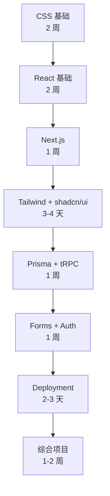
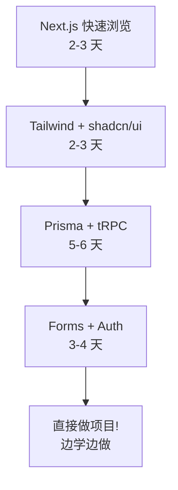

# 快速开始指南

> 🚀 **5 分钟快速上手** - 立即开始使用这套完整的现代前端学习资源

---

## 📖 这是什么？

这是一个完整的现代前端学习计划，包含：

- ✅ **110+ 个实用代码示例** - 可直接运行的真实代码
- ✅ **10 个技术章节** - 从 CSS 到全栈开发
- ✅ **8,500+ 行代码** - 详细注释的高质量实现
- ✅ **3 种学习路径** - 适应不同学习风格

**技术栈**: CSS, React, Next.js 14, Tailwind CSS, shadcn/ui, Prisma, tRPC, NextAuth, Vercel

---

## 🎯 我是谁？我应该从哪里开始？

### 🟢 我是完全新手（无前端经验）

**推荐路径**: 完整顺序学习

```
1. CSS 基础 (stage-2-intermediate/06-css-fundamentals/)
   ↓ 2 周
2. React 基础 (stage-2-intermediate/07-react-basics/)
   ↓ 2 周
3. Next.js App Router (stage-modern-frontend/01-nextjs-app-router/)
   ↓ 1 周
4. 继续后续章节...
```

**立即开始**: 
```bash
# 打开这个文件开始学习
stage-2-intermediate/06-css-fundamentals/README.md
```

---

### 🟡 我会 HTML/CSS/JS，但不熟悉 React

**推荐路径**: 从 React 开始

```
1. React 基础 (stage-2-intermediate/07-react-basics/)
   ↓ 2 周
2. Next.js App Router (stage-modern-frontend/01-nextjs-app-router/)
   ↓ 1 周
3. Tailwind + shadcn/ui (并行学习)
   ↓ 3-4 天
4. 数据层 (Prisma + tRPC)
   ↓ 1 周
5. 业务层 (Forms + Auth)
   ↓ 1 周
```

**立即开始**: 
```bash
# 打开这个文件开始学习
stage-2-intermediate/07-react-basics/README.md
```

---

### 🔴 我会 React，想学现代全栈开发

**推荐路径**: 直接进入 Modern Frontend

```
1. Next.js App Router (快速浏览)
   ↓ 2-3 天
2. Tailwind + shadcn/ui (并行)
   ↓ 2-3 天
3. Prisma + tRPC (数据层)
   ↓ 5-6 天
4. Forms + Auth (业务层)
   ↓ 3-4 天
5. 直接开始做项目！
```

**立即开始**: 
```bash
# 打开这个文件开始学习
stage-modern-frontend/01-nextjs-app-router/README.md
```

---

## 📚 文件导航 - 我应该看什么文件？

### 核心导航文件

| 文件 | 用途 | 适合谁 |
|------|------|--------|
| **[EXAMPLES_INDEX.md](./stage-modern-frontend/EXAMPLES_INDEX.md)** | 📋 所有代码示例总索引 | 所有人（必看！） |
| **[stage-modern-frontend/README.md](./stage-modern-frontend/README.md)** | 📖 现代前端阶段主文档 | 了解整体内容 |
| **各章节/README.md** | 📝 理论和概念讲解 | 学习理论 |
| **各章节/examples/README.md** | 💻 代码示例索引 | 查找代码 |

### 报告文档（可选）

| 文件 | 内容 |
|------|------|
| [CODE_EXTRACTION_REPORT.md](./CODE_EXTRACTION_REPORT.md) | 代码提取完成报告 |
| [FINAL_QUALITY_CHECK.md](./FINAL_QUALITY_CHECK.md) | 最终质量检查报告 |
| [COMPLETION_SUMMARY.md](./COMPLETION_SUMMARY.md) | 项目完成总结 |

---

## 💻 如何使用代码示例？

### HTML/CSS 示例

```bash
# 1. 找到文件
stage-2-intermediate/06-css-fundamentals/examples/flexbox/navbar.html

# 2. 双击打开（或右键 → 打开方式 → 浏览器）

# 3. 修改代码并刷新浏览器查看效果
```

### React/Next.js 示例

**方法 1: 创建新项目**

```bash
# 创建 Next.js 项目
npx create-next-app@latest my-app
cd my-app

# 复制示例代码到项目中
# 例如: 复制 stage-modern-frontend/01-nextjs-app-router/examples/layouts/RootLayout.tsx
# 到 my-app/app/layout.tsx

npm run dev
```

**方法 2: 在线运行 (CodeSandbox)**

```bash
# 1. 访问 https://codesandbox.io
# 2. 选择 React 或 Next.js 模板
# 3. 复制示例代码并粘贴
# 4. 立即预览效果
```

---

## 🗺️ 学习路线图

### 完整学习路径（7-8 周）



### 快速入门路径（3-4 周）



---

## 📋 每日学习计划示例

### 第 1 天: CSS Flexbox

**上午** (2 小时)
- 📖 阅读: `06-css-fundamentals/README.md` 的 Flexbox 部分
- 💻 查看: `examples/flexbox/` 中的 3 个示例
- 🔨 实践: 打开 `navbar.html`，修改样式

**下午** (2 小时)
- 🎯 练习: 创建自己的响应式导航栏
- 📝 笔记: 记录 `justify-content` vs `align-items` 的区别
- 💡 拓展: 尝试不同的 `flex-direction` 值

### 第 2 天: CSS Grid

**上午** (2 小时)
- 📖 阅读: Grid 布局部分
- 💻 查看: `examples/grid/dashboard.html`
- 🔨 实践: 修改 dashboard 的网格结构

**下午** (2 小时)
- 🎯 练习: 实现 Holy Grail 布局
- 📝 对比: Grid vs Flexbox 的使用场景
- 💡 拓展: 尝试命名网格区域

---

## 🎓 学习技巧

### ✅ DO (推荐做法)

- ✨ **先理解后动手**: 先看理论，再看代码，最后自己写
- 📚 **循序渐进**: 按章节顺序学习，不要跳跃
- 🔍 **深入理解**: 每行代码都要理解为什么这样写
- 💪 **多次实践**: 同一个示例看 3 遍不如自己写 1 遍
- 🤝 **做项目**: 尽早应用到实际项目中

### ❌ DON'T (避免做法)

- 🚫 **直接复制粘贴**: 不理解就复制代码到项目
- 🚫 **囫囵吞枣**: 只看不练，理论脱离实践
- 🚫 **贪多求快**: 基础没掌握就学高级内容
- 🚫 **忽略注释**: 代码注释包含重要的说明
- 🚫 **遇到问题就放弃**: 先自己尝试解决

---

## 🔧 环境准备

### 最小依赖（只学 CSS）

- ✅ 任何现代浏览器（Chrome / Firefox / Safari）
- ✅ 任何文本编辑器（VS Code 推荐）

### React 学习环境

```bash
# 安装 Node.js (16.8 或更高版本)
# 下载: https://nodejs.org/

# 验证安装
node -v
npm -v

# 创建 React 项目 (Vite - 推荐)
npm create vite@latest my-react-app -- --template react
cd my-react-app
npm install
npm run dev
```

### Next.js 学习环境

```bash
# 创建 Next.js 项目
npx create-next-app@latest my-nextjs-app
cd my-nextjs-app
npm run dev

# 打开浏览器访问 http://localhost:3000
```

### 推荐 VS Code 插件

- ✅ **ES7+ React/Redux/React-Native snippets**
- ✅ **Tailwind CSS IntelliSense**
- ✅ **Prettier - Code formatter**
- ✅ **ESLint**
- ✅ **Auto Rename Tag**

---

## 📞 获取帮助

### 遇到问题怎么办？

1. **查阅文档**
   - 先看相关章节的 README
   - 查看代码注释
   - 阅读 examples/README.md

2. **检查代码**
   - 对比你的代码和示例代码
   - 使用浏览器开发者工具调试
   - 查看控制台错误信息

3. **搜索答案**
   - Google / Stack Overflow
   - 相关技术的官方文档
   - GitHub Issues

4. **寻求帮助**
   - 社区讨论区
   - GitHub Issues (报告问题)
   - 技术论坛

---

## 🎯 学习检查清单

### CSS 基础 ✅

- [ ] 理解盒模型和布局流
- [ ] 掌握 Flexbox 布局
- [ ] 掌握 Grid 布局
- [ ] 能实现响应式设计
- [ ] 会使用 CSS 变量
- [ ] 能创建动画效果

### React 基础 ✅

- [ ] 理解组件和 Props
- [ ] 掌握 useState Hook
- [ ] 掌握 useEffect Hook
- [ ] 能创建自定义 Hook
- [ ] 能实现表单交互
- [ ] 能构建完整应用

### Next.js ✅

- [ ] 理解 App Router 架构
- [ ] 区分 Server/Client Components
- [ ] 会使用 Server Actions
- [ ] 理解流式渲染
- [ ] 能配置中间件
- [ ] 能部署到 Vercel

---

## 🚀 现在开始！

### 三步快速开始

1. **📋 浏览总索引**
   ```bash
   打开: stage-modern-frontend/EXAMPLES_INDEX.md
   ```

2. **📖 选择起点**
   - 新手: CSS 基础
   - 有基础: React 基础
   - 有经验: Next.js

3. **💻 开始学习**
   - 阅读理论
   - 查看代码
   - 动手实践

---

## 💡 实用资源

### 官方文档

- [React 官方文档](https://react.dev)
- [Next.js 文档](https://nextjs.org/docs)
- [Tailwind CSS 文档](https://tailwindcss.com/docs)
- [MDN Web 文档](https://developer.mozilla.org)

### 学习平台

- [React Dev (交互式教程)](https://react.dev/learn)
- [Next.js Learn](https://nextjs.org/learn)
- [Frontend Masters](https://frontendmasters.com)

### 练习平台

- [CodeSandbox](https://codesandbox.io)
- [StackBlitz](https://stackblitz.com)
- [CodePen](https://codepen.io)

---

## 📊 预期学习成果

完成整个学习计划后，你将能够：

### 技术能力 ✅

- ✅ 独立构建现代前端应用
- ✅ 使用 Next.js + React 开发全栈应用
- ✅ 实现响应式设计和暗黑模式
- ✅ 集成数据库和 API
- ✅ 实现用户认证和授权
- ✅ 部署应用到生产环境

### 职业发展 ✅

- ✅ 达到初级/中级前端工程师水平
- ✅ 能够通过前端技术面试
- ✅ 构建个人作品集项目
- ✅ 参与开源项目贡献

---

**准备好了吗？让我们开始这场现代前端的冒险之旅！** 🚀

→ [查看所有代码示例](./stage-modern-frontend/EXAMPLES_INDEX.md)  
→ [开始 CSS 学习](./stage-2-intermediate/06-css-fundamentals/README.md)  
→ [开始 React 学习](./stage-2-intermediate/07-react-basics/README.md)  
→ [开始 Next.js 学习](./stage-modern-frontend/01-nextjs-app-router/README.md)

---

**最后更新**: 2026-02-08  
**版本**: 1.0.0

**Happy Learning! 💻✨**
