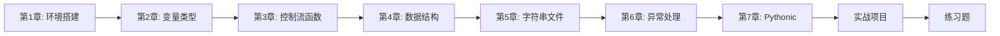

# 阶段 1：入门级 — Python 基础

> *"Readability counts."*
> — The Zen of Python, Line 7

欢迎来到 Python 学习的第一阶段！在这个阶段，你将掌握 Python 的核心语法和编程惯用法，从"写出能运行的代码"进化到"写出 Pythonic 的代码"。

> 🎭 **The Drama：你的第一个 Python 文化冲击**
>
> 如果你从 C/Java 来：`if (x > 0) { return true; }` → `if x > 0: return True`。没有括号，没有花括号，没有分号。你的手指会不自觉地打出 `;`，然后意识到 Python 不需要。
>
> 如果你从 JavaScript 来：`===` 不存在。Python 的 `==` 不会做类型转换。`[] == False` 是 `False`，不像 JS 那样让你怀疑人生。
>
> 无论你从哪里来，Python 都会在第一天教给你这个世界观：**代码是写给人看的，顺便让机器执行。**

## 🎯 学习目标

完成本阶段后，你将能够：

- ✅ 搭建 Python 开发环境，理解 pip、venv 生态
- ✅ 掌握 Python 基础语法：变量、数据类型、运算符
- ✅ 熟练使用控制流和函数（包括 `*args`、`**kwargs`）
- ✅ 精通四大核心数据结构：列表、字典、元组、集合
- ✅ 掌握字符串处理与文件操作（`pathlib` 现代方式）
- ✅ 理解异常处理体系（`try/except/else/finally`）
- ✅ 写出 Pythonic 的代码：推导式、解包、EAFP
- ✅ 独立完成一个命令行任务管理器项目

## 📚 学习内容

### [第 1 章：Python 环境与生态系统](./01-environment-ecosystem/)

**学习时长：** 1-2 天

**核心内容：**
- Python 安装与版本管理（`pyenv`）
- pip 包管理与 `requirements.txt`
- 虚拟环境（`venv`）：为什么每个项目都需要
- 现代工具链：`uv`（超快包管理）、`ruff`（lint + format）
- REPL、IPython、Jupyter 的使用场景
- VS Code + Python 扩展配置

**学习成果：**
- 能搭建完整的 Python 开发环境
- 理解虚拟环境的必要性
- 能使用 `ruff` 保持代码风格一致

> 🧰 **Toolbox：2026 年的 Python 工具链**
>
> 传统方式：`pip` + `virtualenv` + `flake8` + `black` + `isort` — 五个工具各管各的
> 现代方式：`uv` + `ruff` — 两个工具搞定一切，且速度快 10-100 倍
> 本教程全程使用现代工具链，但会在脚注中解释传统方式。

---

### [第 2 章：变量与数据类型](./02-variables-types/)

**学习时长：** 2-3 天

**核心内容：**
- 动态类型 vs 静态类型：Python 的选择与代价
- 数字类型：`int`（无限精度！）、`float`（IEEE 754 的坑）、`complex`
- 布尔与真值判定：Truthy / Falsy 在 Python 中的规则
- `None`：Python 的"空"（不是 `null`，不是 `undefined`）
- 变量是标签，不是盒子：名称绑定 (Name Binding) 模型
- `is` vs `==`：身份比较 vs 值比较
- 不可变性：为什么 `str`、`tuple`、`frozenset` 是不可变的

**学习成果：**
- 理解 Python 的动态类型系统
- 掌握 `is` 和 `==` 的区别（面试高频题）
- 理解 Python 的名称绑定模型

> 🧠 **CS Master's Bridge：Python 变量 ≠ C 变量**
>
> 在 C 中，`int x = 42;` 意味着在栈上分配 4 字节，把 42 写进去。`x` 是内存地址的别名。
> 在 Python 中，`x = 42` 意味着：在堆上创建一个 `int` 对象（值为 42），然后让名字 `x` 指向它。
> `x` 不是盒子，`x` 是贴在对象上的**标签**。同一个对象可以有多个标签（`y = x`），改名不影响对象。
> 这就是为什么 Python 没有"传值"或"传引用"——它是**传对象引用 (Pass by Object Reference)**。

---

### [第 3 章：控制流与函数](./03-control-flow-functions/)

**学习时长：** 3-4 天

**核心内容：**
- 条件语句：`if/elif/else`、三元表达式、`match-case`（3.10+）
- 循环：`for...in`、`while`、`enumerate()`、`zip()`
- 推导式：列表推导式、字典推导式、集合推导式、生成器表达式
- 函数定义：`def`、`lambda`、默认参数、`*args`、`**kwargs`
- 函数是一等公民：传递、返回、存储
- 作用域规则：LEGB（Local → Enclosing → Global → Built-in）
- 闭包：函数记住了出生时的环境
- `walrus operator` `:=`（3.8+）：海象运算符

**学习成果：**
- 熟练使用推导式替代简单循环
- 理解 `*args` 和 `**kwargs` 的打包/解包机制
- 掌握 LEGB 作用域规则
- 能写出简洁的 Pythonic 函数

> 🎭 **The Drama：推导式 — Python 最优雅的武器**
>
> ```python
> # 非 Pythonic — 像 Java 程序员写的 Python
> result = []
> for i in range(10):
>     if i % 2 == 0:
>         result.append(i ** 2)
>
> # Pythonic — 一行搞定，且意图清晰
> result = [i ** 2 for i in range(10) if i % 2 == 0]
> ```
>
> 推导式不只是语法糖——它表达了**意图**：我要从一个序列中筛选并转换，得到一个新序列。
> 循环表达的是**步骤**：初始化列表、遍历、判断、跟加。
> 当你用推导式时，读者一眼就知道结果是什么；用循环时，读者必须在脑中"执行"代码才能理解。

---

### [第 4 章：核心数据结构](./04-data-structures/)

**学习时长：** 3-4 天

**核心内容：**
- **列表 (list)**：动态数组、切片、排序、常用方法
- **元组 (tuple)**：不可变序列、命名元组 (`namedtuple`、`NamedTuple`)
- **字典 (dict)**：哈希表、有序性（3.7+）、`defaultdict`、`Counter`
- **集合 (set)**：去重、集合运算（交并差补）
- `collections` 模块：`deque`、`OrderedDict`、`ChainMap`
- 数据结构选择指南：什么时候用什么

**学习成果：**
- 精通四大数据结构的特性和适用场景
- 掌握切片的高级用法
- 能根据需求选择正确的数据结构

> ⚛️ **The Science：dict 的时间复杂度 — O(1) 的秘密**
>
> Python 的 `dict` 基于哈希表实现，查找、插入、删除均为 **平均 O(1)**。
> 但这个 O(1) 有两个前提：
> 1. **键必须可哈希**：`list` 不可哈希所以不能做键，`tuple` 可以（只要元素都可哈希）
> 2. **不退化**：极端情况下哈希冲突可导致 O(n)，但 CPython 的探测策略让这几乎不会发生
>
> 从 Python 3.7 开始，`dict` **保证插入顺序**。这不是巧合——CPython 3.6 引入了紧凑字典 (Compact Dict) 实现，副作用就是保序，然后 3.7 把它变成了语言规范。

| 数据结构 | 查找 | 插入 | 删除 | 有序 | 可变 | 去重 | 适用场景 |
|---------|------|------|------|------|------|------|---------|
| `list` | O(n) | O(1)* | O(n) | ✅ | ✅ | ❌ | 有序集合、栈 |
| `tuple` | O(n) | — | — | ✅ | ❌ | ❌ | 不可变记录、字典键 |
| `dict` | O(1) | O(1) | O(1) | ✅* | ✅ | 键唯一 | 键值映射、缓存 |
| `set` | O(1) | O(1) | O(1) | ❌ | ✅ | ✅ | 去重、成员判断、集合运算 |
| `deque` | O(n) | O(1)两端 | O(1)两端 | ✅ | ✅ | ❌ | 队列、双端操作 |

*注：list 的 append 是均摊 O(1)；dict 从 3.7+ 保持插入顺序*

---

### [第 5 章：字符串处理与文件操作](./05-strings-files/)

**学习时长：** 2-3 天

**核心内容：**
- 字符串方法：`split`、`join`、`strip`、`replace`、`startswith`
- f-string 格式化（3.6+）：表达式、格式化规范、调试模式（`f"{x=}"`）
- 编码与解码：`str` vs `bytes`、UTF-8、`encode()`/`decode()`
- `pathlib`：现代路径操作（替代 `os.path`）
- 文件读写：`open()`、`with` 语句、读写模式
- 常用格式处理：JSON、CSV、TOML

**学习成果：**
- 熟练使用 f-string 进行字符串格式化
- 用 `pathlib` 处理所有路径操作
- 掌握文件读写的安全模式（`with` 语句）

> 🧰 **Toolbox：`pathlib` vs `os.path` — 新旧之战**
>
> ```python
> # 旧方式 — os.path（字符串拼接，容易出错）
> import os
> path = os.path.join(os.path.expanduser("~"), "documents", "file.txt")
> if os.path.exists(path):
>     with open(path) as f: ...
>
> # 新方式 — pathlib（面向对象，清晰优雅）
> from pathlib import Path
> path = Path.home() / "documents" / "file.txt"
> if path.exists():
>     content = path.read_text()
> ```
>
> `pathlib` 从 Python 3.4 引入，3.6 后获得了完整的生态支持。本教程全程使用 `pathlib`。

---

### [第 6 章：异常处理与调试](./06-exceptions-debugging/)

**学习时长：** 2-3 天

**核心内容：**
- 异常层次结构：`BaseException` → `Exception` → 具体异常
- `try/except/else/finally` 的完整语义
- 自定义异常类
- EAFP vs LBYL：Python 的错误处理哲学
- 调试技巧：`print` 调试、`logging`、`pdb`/`breakpoint()`
- 常见异常速查表

**学习成果：**
- 理解 Python 异常体系的设计哲学
- 掌握 EAFP（请求宽恕比请求许可更容易）的惯用法
- 能使用 `breakpoint()` 进行交互式调试

> 🌌 **The Big Picture：EAFP vs LBYL — Python 的独特哲学**
>
> **LBYL (Look Before You Leap)**：先检查，再操作。Java/C++ 的习惯。
> ```python
> # LBYL 风格
> if key in dictionary:
>     value = dictionary[key]
> else:
>     value = default
> ```
>
> **EAFP (Easier to Ask Forgiveness than Permission)**：先操作，出错再处理。Python 的哲学。
> ```python
> # EAFP 风格 — Pythonic
> try:
>     value = dictionary[key]
> except KeyError:
>     value = default
> ```
>
> 为什么 EAFP 在 Python 中更好？
> 1. **性能**：在"通常成功"的场景下，EAFP 避免了多余的检查
> 2. **原子性**：LBYL 有 TOCTOU 竞态条件（检查和使用之间状态可能改变）
> 3. **鸭子类型**：你不检查类型，你尝试使用——如果它走路像鸭子、叫起来像鸭子，它就是鸭子
>
> 当然，最 Pythonic 的写法是：`value = dictionary.get(key, default)` 😄

---

### [第 7 章：Pythonic 惯用法](./07-pythonic-idioms/)

**学习时长：** 2-3 天

**核心内容：**
- 解包赋值：`a, b = b, a`、`first, *rest = items`
- 推导式进阶：嵌套推导式、条件推导式
- `enumerate()`、`zip()`、`any()`、`all()`
- `_` 惯用法：忽略变量、国际化、REPL 上一个结果
- 切片赋值与切片对象
- `for...else` 和 `while...else`（Python 独有的控制流）
- 可迭代对象解包：`**dict` 合并、`*list` 展开
- 常见反模式与 Pythonic 替代方案

**学习成果：**
- 能识别和改写"非 Pythonic"的代码
- 掌握 Python 独有的惯用法
- 写出让 Python 老手点赞的代码

> 🧘 **Zen of Code：什么是"Pythonic"？**
>
> "Pythonic"不是一个精确的技术术语，它是一种**审美判断**。
> 它意味着代码遵循了 Python 社区的共识：简洁、可读、符合直觉。
>
> ```python
> # ❌ 非 Pythonic（像 C 程序员写的）
> i = 0
> while i < len(items):
>     print(items[i])
>     i += 1
>
> # ❌ 稍好但仍非 Pythonic
> for i in range(len(items)):
>     print(items[i])
>
> # ✅ Pythonic
> for item in items:
>     print(item)
>
> # ✅ 如果需要索引
> for i, item in enumerate(items):
>     print(f"{i}: {item}")
> ```
>
> 核心原则：**直接表达你的意图**。如果你想遍历元素，就遍历元素，不要遍历索引再取元素。

---

### [实战项目：命令行任务管理器](./projects/cli-task-manager/)

**项目时长：** 3-5 天

**项目目标：**
创建一个功能完整的命令行任务管理器，支持：
- ➕ 添加新任务（标题、描述、优先级、截止日期）
- ✏️ 编辑和更新任务
- ✅ 标记任务完成/未完成
- 🗑️ 删除任务
- 🔍 按状态/优先级/关键词筛选
- 📊 任务统计（已完成/进行中/过期）
- 💾 JSON 文件持久化存储
- 🎨 彩色终端输出

**涵盖知识点：**
- 数据结构（字典、列表）
- 函数设计与模块化
- 文件操作（JSON 读写）
- 异常处理
- `pathlib` 路径管理
- `argparse` 命令行参数解析
- f-string 格式化输出
- 结构化日志

**技术栈：**
- 纯 Python 标准库
- `argparse` 命令行解析
- `json` 数据持久化
- `datetime` 日期处理
- `logging` 日志系统

---

### [练习题和评估](./exercises/)

**练习内容：**
- ~20 道编程练习题（难度递增）
  - 基础语法练习 (练习 1-5)
  - 数据结构练习 (练习 6-10)
  - 函数与异常练习 (练习 11-15)
  - Pythonic 惯用法练习 (练习 16-20)
- 自我评估测验
- 阶段完成检查清单

---

## 📋 前置要求

在开始本阶段学习前，请确保你：

- ✅ 有至少一门编程语言的基础（理解变量、循环、函数的概念）
- ✅ 已安装 Python 3.12+ 和 VS Code
- ✅ 了解基本的命令行操作（`cd`、`ls`、`mkdir`）
- ✅ （可选）已完成本项目 JS/TS 学习路径的 Stage 1

## 🎓 学习建议

### 学习顺序

建议按照章节顺序学习，不要跳过：



1. **第 1-2 章** 是基础中的基础，必须掌握
2. **第 3-4 章** 是 Python 的核心竞争力（函数、数据结构），需要大量练习
3. **第 5-6 章** 为项目实战做准备
4. **第 7 章** 是从"会写 Python"到"写好 Python"的关键转折
5. **项目** 综合运用所有知识点

### 学习方法

每个章节的学习流程：

1. **阅读讲解** — 理解概念和原理
2. **运行示例** — 在本地运行所有代码示例（`python examples/xx.py`）
3. **动手实践** — 修改示例代码，观察结果
4. **完成练习** — 独立完成章节练习
5. **对比 JS/TS** — 如果学过 JS/TS，思考 Python 的不同之处

### 时间安排

**总学习时长：** 3-4 周

- **每天学习时间：** 2-3 小时
- **理论学习：** 40%
- **实践编码：** 60%

**每周安排建议：**
- 第 1 周：第 1-3 章（环境、类型、函数）
- 第 2 周：第 4-5 章（数据结构、字符串/文件）
- 第 3 周：第 6-7 章（异常处理、Pythonic）
- 第 4 周：完成项目 + 练习题

## ✅ 完成标准

完成本阶段后，你应该能够：

- [ ] 独立搭建 Python 开发环境（虚拟环境、linter）
- [ ] 解释 Python 的名称绑定模型（变量是标签不是盒子）
- [ ] 熟练使用推导式、解包、f-string 等 Pythonic 惯用法
- [ ] 精通 `list`、`dict`、`tuple`、`set` 的特性和适用场景
- [ ] 用 `pathlib` 和 `with` 语句安全地处理文件
- [ ] 理解 EAFP 异常处理哲学
- [ ] 完成命令行任务管理器项目
- [ ] 通过阶段练习题（正确率 ≥ 80%）

## 🚀 开始学习

准备好了吗？让我们从搭建环境开始！

**[👉 第 1 章：Python 环境与生态系统](./01-environment-ecosystem/)**

---

## 📖 参考资源

- [Python 官方教程](https://docs.python.org/3/tutorial/)
- [Python 官方标准库参考](https://docs.python.org/3/library/)
- [Real Python](https://realpython.com/) — 高质量 Python 教程网站
- [Python Tips](https://book.pythontips.com/) — Python 技巧合集
