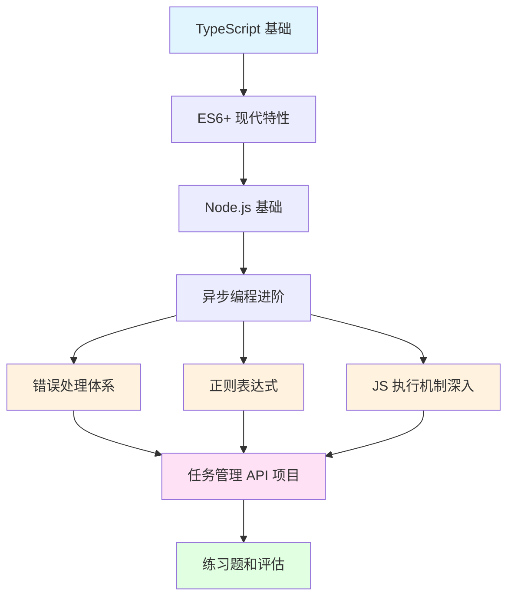

# 阶段 2：进阶级 - TypeScript 入门

欢迎进入 JavaScript 和 TypeScript 学习计划的第二阶段！在这个阶段，你将学习 TypeScript 类型系统、ES6+ 现代特性、Node.js 后端开发，并通过一个完整的 API 项目来实践所学知识。

## 学习目标

完成本阶段后，你将能够：

- ✅ 掌握 TypeScript 类型系统和高级类型
- ✅ 熟练使用 ES6+ 现代特性（类、模块、迭代器等）
- ✅ 使用 Node.js 进行后端开发
- ✅ 掌握异步编程的高级模式
- ✅ 构建 RESTful API 服务
- ✅ 实现数据持久化和中间件
- ✅ 独立完成一个完整的后端项目

## 前置知识

在开始本阶段之前，请确保你已经：

- 完成阶段 1：JavaScript 基础
- 掌握 JavaScript 基础语法和数据类型
- 理解函数、作用域和闭包
- 熟悉数组和对象操作
- 了解 Promise 和 async/await 基础
- 会进行基本的 DOM 操作

## 学习内容

### 1. TypeScript 基础

**章节链接**：[01-typescript-basics](./01-typescript-basics/README.md)

学习内容：
- TypeScript 环境配置和编译器
- 类型注解和类型推断
- 基本类型系统（原始类型、数组、元组、枚举）
- 接口（Interface）和类型别名（Type）
- 联合类型和交叉类型
- 类型断言和类型守卫
- tsconfig.json 配置

**预计学习时间**：6-8 小时

**核心知识点**：
- ✨ 为什么使用 TypeScript？
- ✨ 类型安全的好处
- ✨ 如何定义复杂的类型结构
- ✨ Interface vs Type 的选择

### 2. ES6+ 现代特性

**章节链接**：[02-es6-features](./02-es6-features/README.md)

学习内容：
- 模块系统（import/export）
- 类（Class）和继承
- 迭代器（Iterator）和生成器（Generator）
- Symbol 类型
- Map 和 Set 数据结构
- WeakMap 和 WeakSet
- 可选链（?.）和空值合并（??）

**预计学习时间**：8-10 小时

**核心知识点**：
- ✨ ES 模块化开发
- ✨ 面向对象编程
- ✨ 高级数据结构的使用
- ✨ 现代 JavaScript 语法糖

### 3. Node.js 基础

**章节链接**：[03-nodejs-basics](./03-nodejs-basics/README.md)

学习内容：
- Node.js 运行时环境和事件循环
- 全局对象和进程管理
- 文件系统操作（读写、目录、流）
- HTTP 模块和服务器创建
- Express 框架入门
- 中间件的概念和应用
- 路由模块化
- NPM/Yarn 包管理

**预计学习时间**：10-12 小时

**核心知识点**：
- ✨ 服务器端 JavaScript
- ✨ 异步 I/O 操作
- ✨ Web 服务器开发
- ✨ RESTful API 设计

### 4. 异步编程进阶

**章节链接**：[04-async-advanced](./04-async-advanced/README.md)

学习内容：
- Promise 深入（all, allSettled, race, any）
- async/await 高级用法和最佳实践
- 并发控制和队列管理
- 重试机制和错误处理策略
- 事件循环和微任务/宏任务
- 防抖（Debounce）和节流（Throttle）

**预计学习时间**：8-10 小时

**核心知识点**：
- ✨ Promise 组合模式
- ✨ 并发控制策略
- ✨ 异步错误处理
- ✨ 性能优化技巧

### 5. 错误处理体系

**章节链接**：[08-error-handling](./08-error-handling/README.md)

学习内容：
- 错误的哲学：错误是系统与现实世界交互的必然产物
- Error 类型体系（Error、TypeError、RangeError 等）
- 自定义错误类的设计与实现
- 同步与异步错误处理的统一模型
- 全局错误兜底（window.onerror、unhandledrejection）
- 错误处理策略：抛出 vs 返回、Result 模式
- 结构化错误日志与可观测性设计

**预计学习时间**：6-8 小时

**核心知识点**：
- ✨ 错误的三重人格：Bug、业务例外、环境灾难
- ✨ Fail Fast vs Fail Safe 设计原则
- ✨ Result 模式（Go/Rust 风格的错误处理）
- ✨ 错误信息的可追溯性

### 6. 正则表达式

**章节链接**：[09-regexp](./09-regexp/README.md)

学习内容：
- 正则表达式的本质：声明式的字符串模式匹配语言
- 基础语法（字符类、量词、锚点、转义）
- 捕获组与反向引用（命名捕获 `(?<name>)`）
- 断言（Lookaround）：前瞻、后顾、否定断言
- JavaScript 中的 RegExp API（test、match、matchAll、replace）
- 常见实战模式（邮箱、URL、手机号、密码强度）
- 性能与安全：回溯灾难与 ReDoS 攻击

**预计学习时间**：6-8 小时

**核心知识点**：
- ✨ 正则的读写不对称性（write-only language）
- ✨ 有限状态自动机（NFA/DFA）原理
- ✨ 命名捕获组：从位置依赖到语义依赖
- ✨ ReDoS 攻击与防御

### 7. JavaScript 执行机制深入

**章节链接**：[10-js-execution-model](./10-js-execution-model/README.md)

学习内容：
- 执行上下文（Execution Context）：全局/函数/eval 三种上下文
- 词法环境（Lexical Environment）：Environment Record + 外部引用
- 变量提升的统一模型（var、let/const、function、class 的差异）
- 暂时性死区（TDZ）：let 在声明前不可访问的本质
- 闭包的底层实现：词法环境的引用链
- 尾调用优化（TCO）：ES6 规范与现实支持状况
- `this` 绑定的完整规则：new > 显式 > 隐式 > 默认

**预计学习时间**：8-10 小时

**核心知识点**：
- ✨ 执行上下文 = 舞台剧的场景切换
- ✨ 词法环境 = 作用域链的链表实现
- ✨ TDZ = 薛定谔的变量（存在但不可触碰）
- ✨ 从规则到推论：理解"为什么"而非记忆"是什么"

## 实战项目

### 任务管理 API

**项目链接**：[projects/task-api](./projects/task-api/README.md)

**项目描述**：
使用 TypeScript、Express 和 Node.js 构建一个完整的 RESTful API，实现任务管理系统的后端服务。

**主要功能**：
- 创建、读取、更新、删除（CRUD）任务
- 任务状态管理（待办/进行中/已完成）
- 任务优先级设置
- 数据持久化到 JSON 文件
- 输入验证和错误处理
- 结构化的项目组织

**技术要点**：
- TypeScript 类型系统应用
- Express 路由和中间件
- 文件系统数据存储
- RESTful API 设计
- 错误处理和日志记录

**预计完成时间**：12-16 小时

## 练习和评估

**练习题链接**：[exercises](./exercises/README.md)

本阶段包含以下类型的练习：

1. **TypeScript 类型练习**（9 题）
   - 类型定义和接口设计
   - 泛型实现
   - 类型守卫编写

2. **ES6+ 特性练习**（6 题）
   - 类和继承实现
   - 迭代器和生成器
   - Map/Set 数据结构应用

3. **Node.js 操作练习**（5 题）
   - 文件读写操作
   - 异步流处理
   - CLI 工具开发

4. **异步编程练习**（8 题）
   - Promise 链式调用
   - 并发控制实现
   - 重试机制编写

5. **综合项目练习**（2 题）
   - 完整的 CLI 工具
   - 数据处理管道

**自我评估测试**：
- 选择题（5 题）
- 编程题（3 题）

## 学习路径

建议按以下顺序学习：

**具体步骤**：

1. **第 1 周**：学习 TypeScript 基础
   - 完成 01-typescript-basics 章节
   - 做相关练习题
   - 理解类型系统的核心概念

2. **第 2 周**：学习 ES6+ 特性和 Node.js
   - 完成 02-es6-features 章节
   - 完成 03-nodejs-basics 章节
   - 练习模块化和文件操作

3. **第 3 周**：深入异步编程
   - 完成 04-async-advanced 章节
   - 练习并发控制和错误处理

4. **第 4 周**：错误处理与正则表达式
   - 完成 08-error-handling 章节
   - 完成 09-regexp 章节
   - 练习自定义错误类和正则实战模式

5. **第 5 周**：JavaScript 执行机制深入
   - 完成 10-js-execution-model 章节
   - 理解执行上下文、词法环境、TDZ
   - 准备开始项目

6. **第 6 周**：实战项目
   - 完成任务管理 API 项目
   - 实现所有 CRUD 功能
   - 测试和优化

7. **第 7 周**：巩固和评估
   - 完成所有练习题
   - 进行自我评估测试
   - 复习薄弱环节

**总预计时间**：80-90 小时

## 学习建议

### 有效学习策略

1. **边学边练**
   - 每学完一个概念，立即编写代码实践
   - 不要只是阅读，要动手写
   - 尝试修改示例代码，观察结果

2. **记录日志**
   - 在代码中添加 console.log 跟踪执行流程
   - 理解异步操作的执行顺序
   - 养成调试的好习惯

3. **注重理解**
   - 不要死记硬背语法
   - 理解"为什么"比记住"怎么做"更重要
   - 思考每个特性解决了什么问题

4. **循序渐进**
   - 不要跳过基础章节
   - 确保理解前一个概念再继续
   - 遇到困难时回头复习

5. **实践为王**
   - 尽早开始项目实战
   - 在项目中应用所学知识
   - 从错误中学习

### 常见问题

**Q: TypeScript 和 JavaScript 有什么区别？**

A: TypeScript 是 JavaScript 的超集，添加了静态类型系统。主要区别：
- TypeScript 需要编译成 JavaScript 才能运行
- TypeScript 提供编译时类型检查
- TypeScript 有更好的 IDE 支持和代码提示
- 所有有效的 JavaScript 代码都是有效的 TypeScript 代码

**Q: 我应该一直使用 any 类型吗？**

A: 不应该。`any` 会绕过类型检查，失去 TypeScript 的优势。应该：
- 尽可能定义具体的类型
- 对于未知类型，使用 `unknown` 而非 `any`
- 使用类型守卫来处理不确定的类型

**Q: Promise 和 async/await 有什么区别？**

A: `async/await` 是 Promise 的语法糖：
- `async/await` 让异步代码看起来像同步代码
- `async/await` 更易于理解和调试
- 底层仍然是 Promise
- 可以混合使用两种语法

**Q: 什么时候使用 Map，什么时候使用普通对象？**

A: 使用 Map 当：
- 键需要是对象或其他非字符串类型
- 需要频繁添加和删除键值对
- 需要迭代键值对
- 需要知道大小（size）

使用对象当：
- 键是字符串或 Symbol
- 需要 JSON 序列化
- 结构相对固定

**Q: 如何决定是否使用 Express 还是原生 HTTP 模块？**

A: 
- 学习阶段：了解原生 HTTP 模块有助于理解底层原理
- 实际项目：Express 提供了更好的开发体验
- Express 有丰富的中间件生态
- 复杂项目建议使用框架

## 完成标准

完成本阶段后，你应该能够：

- [ ] 熟练使用 TypeScript 定义类型
- [ ] 理解并使用 ES6+ 的类、模块、迭代器
- [ ] 使用 Node.js 进行文件和网络操作
- [ ] 创建和部署 RESTful API 服务
- [ ] 掌握 Promise 和 async/await 的高级用法
- [ ] 实现并发控制和错误处理
- [ ] 独立完成任务管理 API 项目
- [ ] 通过所有练习题和自我评估

## 资源和参考

### 官方文档

- [TypeScript 官方文档](https://www.typescriptlang.org/docs/)
- [Node.js 官方文档](https://nodejs.org/docs/)
- [Express 官方文档](https://expressjs.com/)
- [MDN Web Docs - JavaScript](https://developer.mozilla.org/zh-CN/docs/Web/JavaScript)

### 推荐阅读

- TypeScript 编程（书籍）
- 深入理解 TypeScript（在线电子书）
- Node.js 设计模式（书籍）
- JavaScript 异步编程（书籍）

### 在线工具

- [TypeScript Playground](https://www.typescriptlang.org/play)
- [Node.js REPL](https://nodejs.org/api/repl.html)
- [Postman](https://www.postman.com/) - API 测试工具
- [Thunder Client](https://www.thunderclient.com/) - VSCode 插件

### 社区资源

- [Stack Overflow](https://stackoverflow.com/questions/tagged/typescript)
- [GitHub TypeScript Topic](https://github.com/topics/typescript)
- [TypeScript 中文社区](https://www.tslang.cn/)

## 下一步

完成本阶段后，你可以：

1. **继续深入学习**
   - 进入阶段 3：高级 - 深入 TypeScript 和架构
   - 学习高级类型、装饰器、设计模式

2. **扩展项目**
   - 为任务管理 API 添加用户认证
   - 集成真实的数据库（MongoDB、PostgreSQL）
   - 添加单元测试和集成测试

3. **实践应用**
   - 构建自己的项目
   - 参与开源项目
   - 分享学习心得

## 获取帮助

如果在学习过程中遇到问题：

1. 仔细阅读错误信息和文档
2. 查看示例代码和练习题的参考答案
3. 在代码中添加日志，跟踪执行流程
4. 搜索相关问题（Stack Overflow、GitHub Issues）
5. 向社区或导师寻求帮助

记住：**遇到困难是学习的正常过程，坚持下去！**

## 总结

阶段 2 是从 JavaScript 到 TypeScript、从前端到后端的重要过渡。通过本阶段的学习，你将掌握现代 JavaScript/TypeScript 开发的核心技能，为成为全栈开发者打下坚实的基础。

**关键要点**：
- ✅ TypeScript 让代码更安全、更易维护
- ✅ ES6+ 特性让代码更简洁、更强大
- ✅ Node.js 让 JavaScript 可以在服务器端运行
- ✅ 异步编程是 JavaScript 的核心特性
- ✅ 实战项目是巩固知识的最佳方式

**加油！你已经在成为优秀开发者的路上了！🚀**

---

[← 返回阶段 1](../stage-1-beginner/README.md) | [继续阶段 3 →](../stage-3-advanced/README.md)
